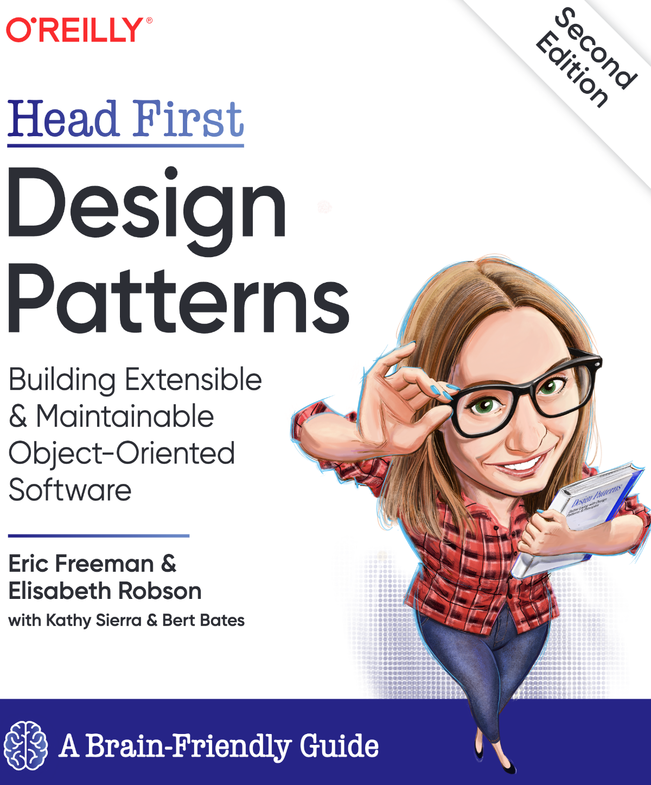
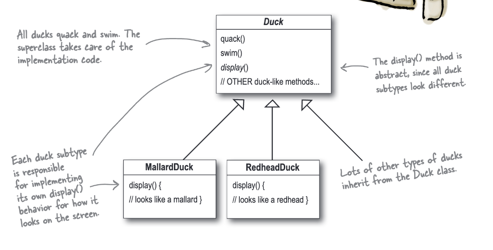
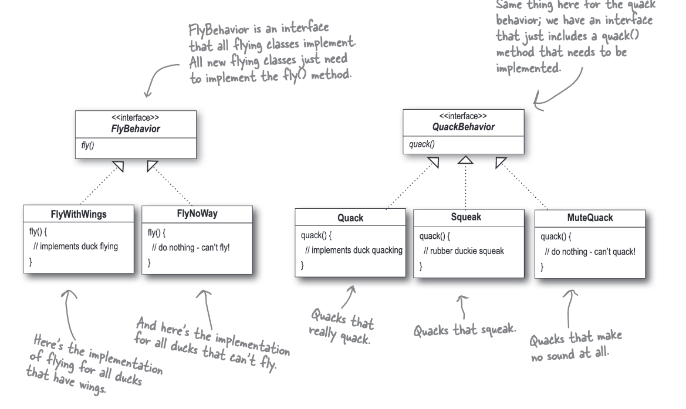
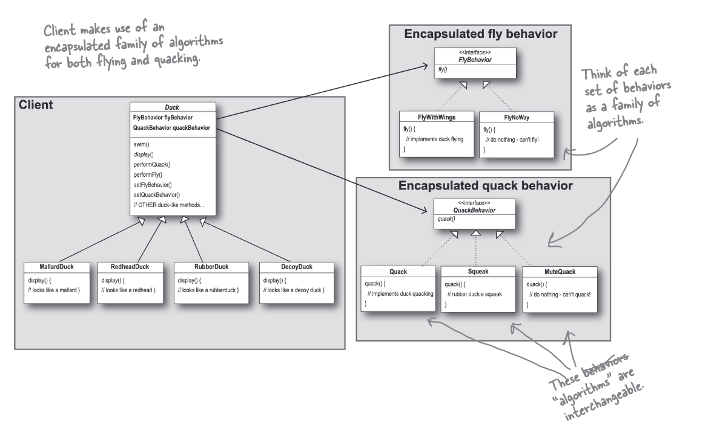
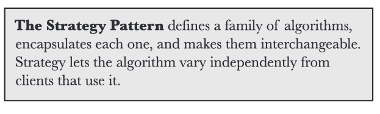
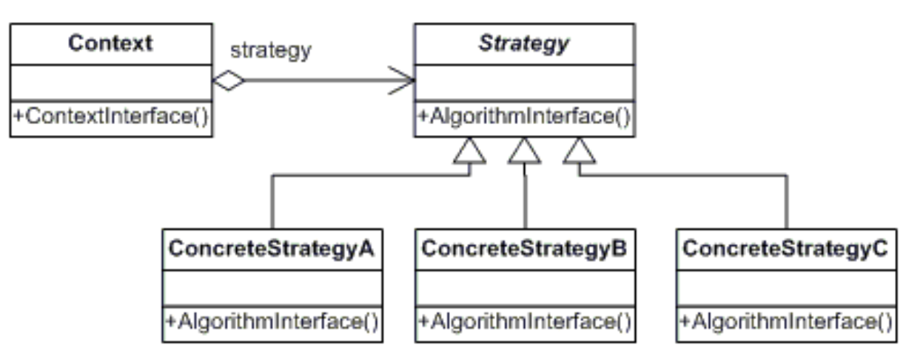

## Strategy

### Fecha: 16/02/2025

- **Notas:**
  - Aplicación SimUDuck, el diseño inicial usa el concepto de POO herencia para representar varios patos.  
  
  - Requerimiento, los patos deben volar -> Añadir un método en la súper clase -> Aunque estoy reusando, en términos de mantenibilidad tengo problemas pues no todos los patos deben volar -> Override en los métodos de los patos que no deben volar -> Código duplicado en diversas clases de patos que no vuelan, no hay posibilidad de cambios en tiempo de ejecución, dificil mantener el conocimiento de todos los patos y los cambios pueden afectar a otros patos que no deberían. 
  - Qué tal si hacemos una interfaz para el comportamiento de volar con el método y que los patos la implementen -> Código duplicado de patos con los mismos comportamientos de vuelo, pasamos de un problema de mantenimiento a otro. Ni la herencia ni una interaz común de comportamiento nos funcionan para mantener el código.
  -  Sabemos que el cambio es una constante en cualquier aplicación y que un principio de diseño nos dice *"Identifica los aspectos de tu aplicación que cambian y separalos de lo que se mantiene igual"*, en otras palabras, "Toma las partes que varian y encapsulalas así luego puedes extenderlas sin afectar las partes que no varian". Todos los patrones permiten de alguna forma que una parte varie independientemente de otras, el resultado son menos consecuencias no deseadas y más flexibilidad en los sistemas.
  - Sabemos que los comportamientos como el vuelo o el quack varian en los patos, separemos estos comportamientos en clases en donde pongamos sus métodos. 
  - Otro principio de diseño nos indica *"Programa sobre una interfaz no sobre una implementación"*. Si hacemos que cada comportamiento sea una interfaz y creamos comportamientos especificos como clases que la implementen. Pasamos del comportamiento en una implemtación concreta en la súper clase de pato o cada pato a una interfaz de comportamiento en cada pato especifico. Programar a una interfaz es programar a un súper tipo, no tiene que ser necesariamente el concepto de interfaz de cada lenguaje, una clase abstracta también es válida.
  
  - Estamos reusando comportamientos pero también abiertos a nuevos de ellos sin modificar los que ya existen. 
  - Algunas anotaciones, aunque en POO el concepto de clase se mapee a objetos de la realidad, que una clase sea un comportamiento está bien, el comportamiento tiene sus atributos y métodos propios. También, cuando estamos diseñando un sistema podemos anticiparnos a estos cambios analizando partes que varian o puedan variar en un futuro, no es solo para refactor. 
  
  - La línea negra completa son HAS-A, línea punteada cabeza blanca IMPLEMENTS, línea punteada cabeza negra IS-A o EXTENDS/INHERITS. 
  - Otro principio de diseño *"Favorece composición sobre herencia"*. Aquí favorecemos composición HAS-A sobre IS-A al poner los comportamientos en el pato como los ponemos. Nos da flexibilidad, encapsulamos los comportamientos en sus clases y podemos cambiar de comportamiento en tiempo de ejecución con los setters.
  - Strategy. 
  
  

- **Puntos clave:**
  - Los buenos diseños de POO son resuables, extendibles y mantenibles. 
  - Los patrones son experiencias probadas de POO. 
  - Los patrones no son código, son soluciones generales a problemas. 
  - Los patrones se discubren. 
  - La mayoría de patrones se enfocan en cambios y en permitir que partes varien de manera independiente. 
  - Encapsula lo que varia. 
  - Los patrones dan un lenguaje compartido.
 
  

## Recursos Adicionales
- [Book](https://github.com/ajitpal/BookBank/blob/master/%5BO%60Reilly.%20Head%20First%5D%20-%20Head%20First%20Design%20Patterns%202nd%20Edition%20-%20%5BFreeman%5D.pdf)