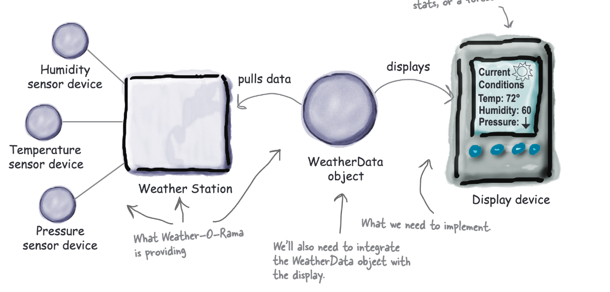
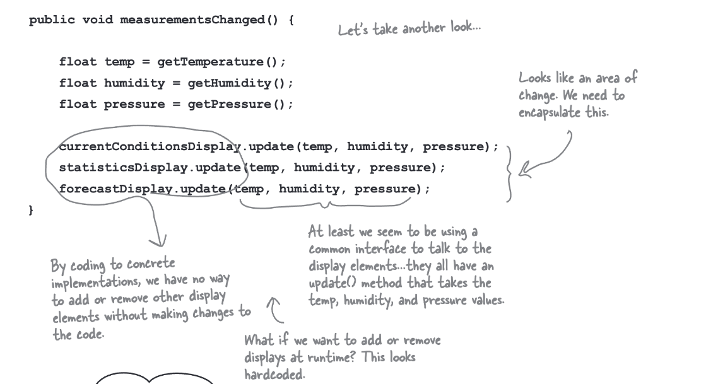
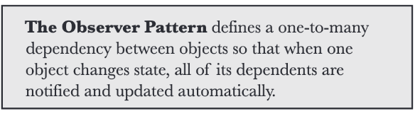
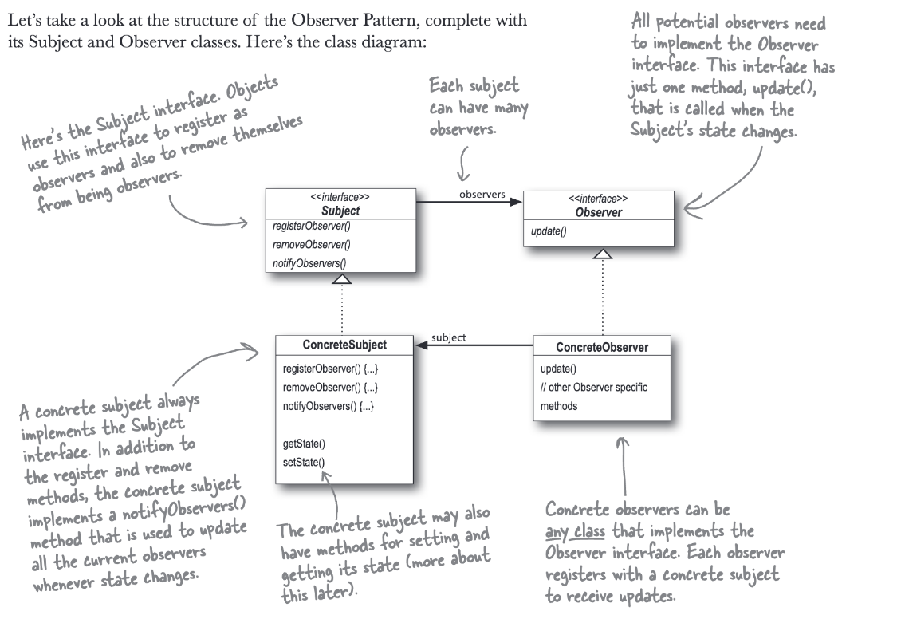
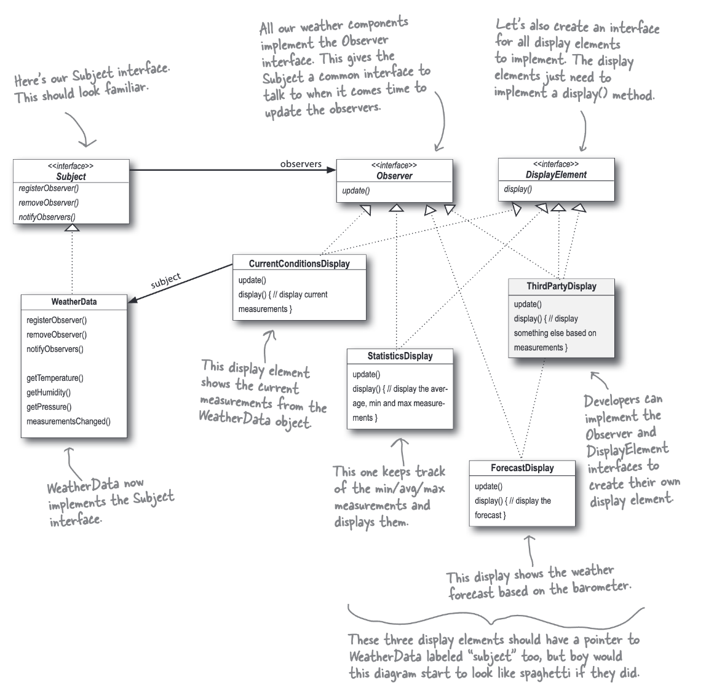

## Observer

### Fecha: 16/02/2025

- **Notas:**
  - Aplicación de clima, tres componentes, solo vamos a modificar el componente que actualiza los displays, hay tres tipos Forecast, Stats y Current Conditions.  
  
  - Pensemos en el futuro, podemos tener más displays diferentes, deberíamos permitir la creación y eliminación de estos y en tiempo de ejecución. 
  - Una implemntación érronea, modificiaría la clase que tiene el método que actualiza los displays y haria el llamado a estos para que se actualicen -> Estamos trabajando sobre implementaciones, para cada display debemos añadirlo en esa función, no podemos añadir o eliminar en tiempo de ejecución y no hemos encapsulado las partes que cambian. 
  
  - El patrón observer como un publisher de revistas, la gente se suscribe o se da de baja, la gete suscrita recibe las nuevas revistas cuando son publicadas. El publisher es el Subject y la gente los Observers. 
  
  
  - Define una relación uno a muchos entre objetos, cuando el estado de uno cambia, se notifica a sus dependientes. 
  - Un principio de diseño nos indica *"Apunta a diseños poco acoplados de objetos que interactuan"*. En este caso, poco acoplado entre dos objetos se refiere a bjetos que pueden interactuar pero tienen poco conocimiento sobre el otro. Esto nos da mucha flexibilidad. 
  - En el patrón observer, el subject solo sabe del observer que este está implementando la interfaz necesaria, podemos añadir observers en cualquier momento, también removerlos. No debemos modificar el subject para añadir nuevos tipos de observers, con implementar la interfaz basta. Podemos reusar subjects y observers y los cambios sobre estos no afectan mientras que no movamos las obligaciones de implementar las interfaces base. 
  
  - El enfoque push or pull al actualizar en el observer se diferencia en cómo declaramos el método, si hacemos un push entonces pasamos a todos los observers todos los "estados"/atributos del subject, usando pull no pasamos nada y usando un getter obtenemos del subject los atributos que necesitemos unicamente.

- **Puntos clave:**
  - El observer define una relación 1-M. 
  - Subject actualiza al Observer usando interfaces base/comunes. 
  - Observadores de muchos tipo pueden participar siempre y cuando implementen la interfaz base. 
  - Es poco acoplado, subject solo sabe que el observer implementa una interfaz. 
  - Podemos hacer push o pull de los states/atributos del subject.
  - Es similar al Pub/Sub pero este es más complejo, con más subjects y/o tipos de mensajes. 

## Recursos Adicionales
- [Book](https://github.com/ajitpal/BookBank/blob/master/%5BO%60Reilly.%20Head%20First%5D%20-%20Head%20First%20Design%20Patterns%202nd%20Edition%20-%20%5BFreeman%5D.pdf)