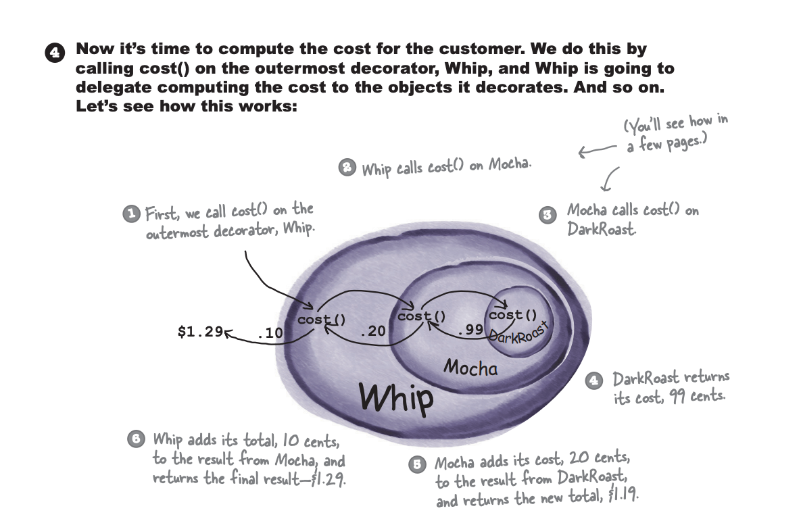

## Decorator

### Fecha: 19/02/2025

- **Notas:**
  - Tienda de café, con este modelo de clases 
  
  - A cada bebida se le pueden agregar/extender condimentos, si hacemos una clase por cada condimento x bebida, tendremos demasiadas.
  - Si manejamos los condimentos como variables en la clase abstracta, podemos controlar que cada bebida tenga o no condimento y según eso modificar el costo pero cambio en el precio de los condimentos, condimentos que no tienen nada que ver con ciertas bebidas y nevos condimentos son problemas de mantenimiento.
  - Ya aprendimos que la herencia es poderosa pero no es la mejor para diseños flexibles y mantenibles. La herencia de comportamientos usando composición y delegación puede extender comportamientos en tiemo de ejecución y darnos mucha flexibilidad, añadir nuevas funcionalidades sin alterar el código existente, eso se traduce en menos consecuencias indeseadas.
  - Principio de diseño *"Clases deben ser abiertas a extensión y cerradas a modificación"*.
  - Usualmente no se puede hacer que todo siga el principio, llevaría a mucho código y mucha complejidad, toca priorizar esas áreas que son propensas a cambios. 
  - El patrón decorador decora clases dandoles comportamiento en tiempo de ejecución. Iniciamos con un objeto, por ejemplo de bebida y lo decoramos con un condimento, luego una cadena de delegación por ejemplo al calcular el costo es la que está dandonos comportamiento nuevo.
  
  
  - Los decoradores tienen el mismo supertipo que los objetos que decoran. 
  - Se pueden usar n decoradores.
  - Añade comportamiento antes y/o después de delegar a objeto que decoran de hacer el resto del trabajo.
  - Puede decorarse en tiempo de ejecución.
  - Usamos herencia para lograr el match de tipos y supertipos, pero no la usamos para el comportamiento, la composición de un decorador con un objeto (al que decora) es la que nos da ese comportamiento adicional.
  
  
  - Si se tiene código que depende netamente de los supertipos entonces se debe replantear el uso de decoradores, pues esta dependencia va a romper el sistema. 
  - Manejar más objetos en este patrón si incrementa las chances de errores de código pero por eso se combina con otros.
  - En conclusión, sí añadimos flexibilidad pero podemos tener el problema de muchos decoradores pequeños que agreguen mucha complejidad, o romper algo por dependencia de los supertipos en otras partes del código.

- **Puntos clave:**
  - Herencia es una manera de extender pero no la mejor para dar flexibilidad. 
  - Debemos permitir extender comportamientos sin modificar los actuales. 
  - Composición y delegación son usados para dar comportamiento en tiempo de ejecución. 
  - Decorador sirve como alternativa a las subclases y extender comportamientos. 
  - El decorador involucra un conjunto de clases decoradoras que encapsulan componentes concretos. 
  - El decorador tiene el mismo tipo del componente que decoran. 
  - Decorador añade comportamiento antes o después de las llamadas de métodos en el componente. 
  - Decoradores deberían ser transparentes al consumidor del componente. 
  - Decorador pueden resultar en muchos objetos pequeños y complejidad.

## Recursos Adicionales
- [Book](https://github.com/ajitpal/BookBank/blob/master/%5BO%60Reilly.%20Head%20First%5D%20-%20Head%20First%20Design%20Patterns%202nd%20Edition%20-%20%5BFreeman%5D.pdf)