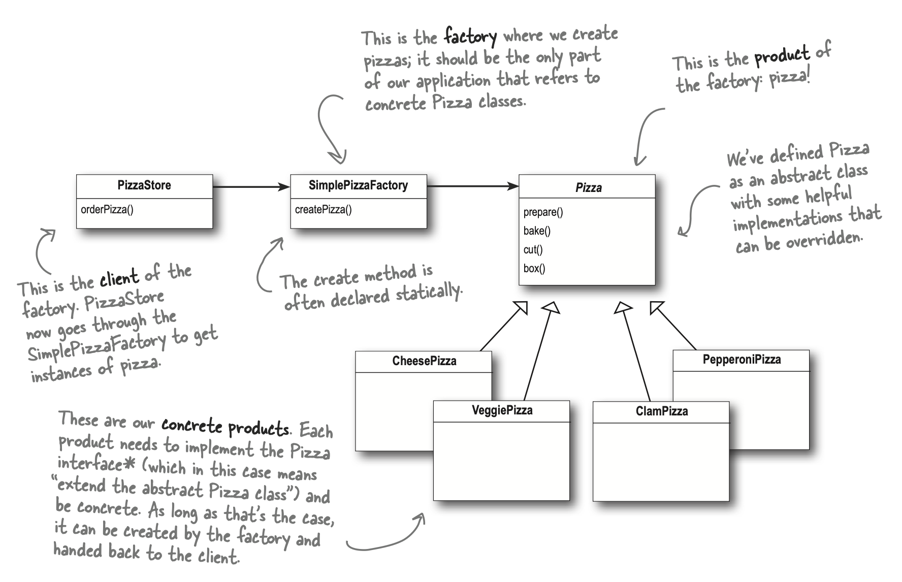
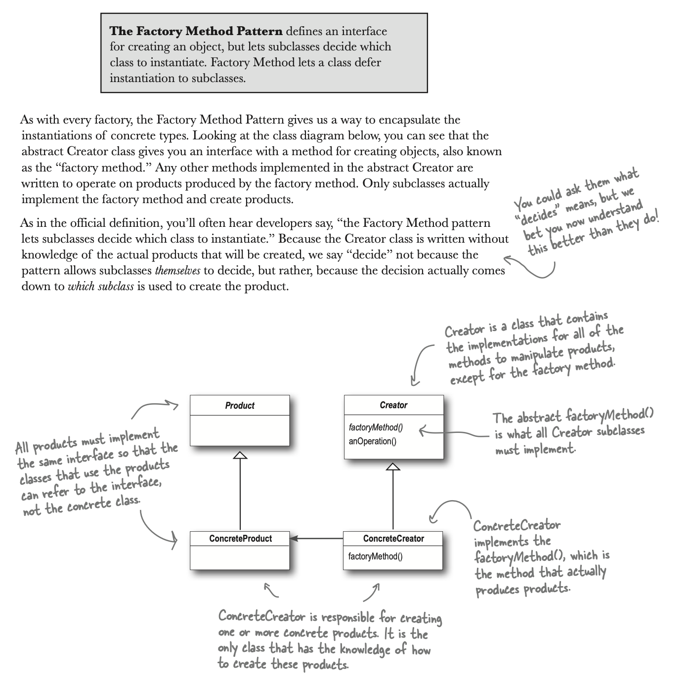

## Factory Method

### Fecha: 23/02/2025

- **Notas:**
  - Una aclaración, los principios hablan de programar sobre interfaces pero siempre terminamos creando objetos con new, implementaciones. La realidad es que, no hay nada de malo en la creación de objetos con new, es algo natural que debe suceder para construir algo, el culpable bajo de todo es el cambio y su impacto sobre estas implementaciones. Si usamos interfaces, nuevas clases implementando esta interfaz pueden ser añadidas pero si tenemos solo clases concretas sin abstracción entonces el cambio es peligroso y no estaremos cerrando el código a modificaciones. Identifica lo que cambia y separalo. 
  
  - Encapsular la creación de objetos es el proposito de Factory. Estos patrones se encargan de los detalles de la creación de objetos. En su estado más simple, un factory es una clase que le da a sus clientes un método de creación de un producto y solo la factory debe crear esos productos, estamos reutilizando código y centralizando en un solo lugar para cambio, así los clientes no tendrán clases concretas. NO ES un patrón de diseño es más un idioma muy usado en programación para encapsular y centralizar la creación de un producto. 
  
  - Imaginemos que la pizzeria ahora tiene franquicias, queremos crear un framework en donde el proceso de fabricación de pizza sea el mismo pero cada franquicia tenga sus tipos de pizzas. Si el proceso es el mismo entonces la clase PizzaStore en donde la lógica de preparación se encuentra debe ser la misma, esta será nuestra interfaz o clase asbtracta y por tanto la creación de pizza ya no la delegamos a una clase con todas las posibles pizzas sino que hacemos un método abstracto que las clases hijas de la store, las franquicias, deban implementar para poner en cada una sus pizzas espeficicas. La decisión se hace en runtime de que franquicia debo crear/ejecutar.
  
  
  
  - Tengo dos jerarquias paralelas, las de creadores y de productos, conectadas a través de la interfaz de producto.
  - El Factory Method nos permite encapsular la creación de objetos concretos, la clase asbtracta creadora nos da un método para esta creación, los otros métodos son para uso compartido de las subclases, estas solo deben implementar la creación abstracta a su especificidad. 
  
  - Si solo tengo un creador concreto igual estoy desacoplando la implementación del producto de su uso, si añado o cambio uno en especifico no afecto mi creador sino los concretos. A pesar de que cada creador concreto para un simple factory estos están como hijos de un abstracto con un método destinado a la creación, en la simple es la composición de un objeto de clase SimpleFactory. Un creador concreto puede solo crear un tipo de producto y no ser parametrizable.
  - Aprendimos que el código que instancia implementaciones concretas es un área de frecuente cambio, podemos encapsular esta creación de objetos en un objeto/clase o método para evitar código duplicado, dar mantenibilidad y quitar de los clientes dependencia de clases concretas implemntaciones a uso de interfaces. La creación de objetos es una realidad, tiene que pasar siempre pero no regada como un caos. 
  - Por último, la dependecia de objetos se da cuando se instancia directamente un objeto de una clase, ese lugar se volvió dependiente, entre menos dependencias, mucho mejor. Hay un principio de inversión de dependencias que dice *"Depende de abstracciones no de clases concretas"* suena parecido a programar sobre interfaces y no implementaciones pero este va más allá, componentes de alto nivel no deben depender de los de bajo nivel, ambos deben depender de abstracciones. Un componente de alto nivel es una clase cuyo comportamiento estpa definido de términos de otra, un componente de bajo nivel. PizzaStore es de alto nivel, las pizzas especificas son de bajo nivel, ahora la store depende de la abstracción llamada Pizza que es lo que devuelve el método abstracto de creación de pizza.
  - Para seguir este principio ten en cuenta que hay unas recomendaciones, que puede ser justificable saltarse, estas son: 
    - Ninguna variable debe sostener una referencia a una clase concreta. 
    - Ninguna clase debe derivar de una clase concreta. 
    - Ningún método debe override un método implementado en su clase base. 

## Recursos Adicionales
- [Book](https://github.com/ajitpal/BookBank/blob/master/%5BO%60Reilly.%20Head%20First%5D%20-%20Head%20First%20Design%20Patterns%202nd%20Edition%20-%20%5BFreeman%5D.pdf)