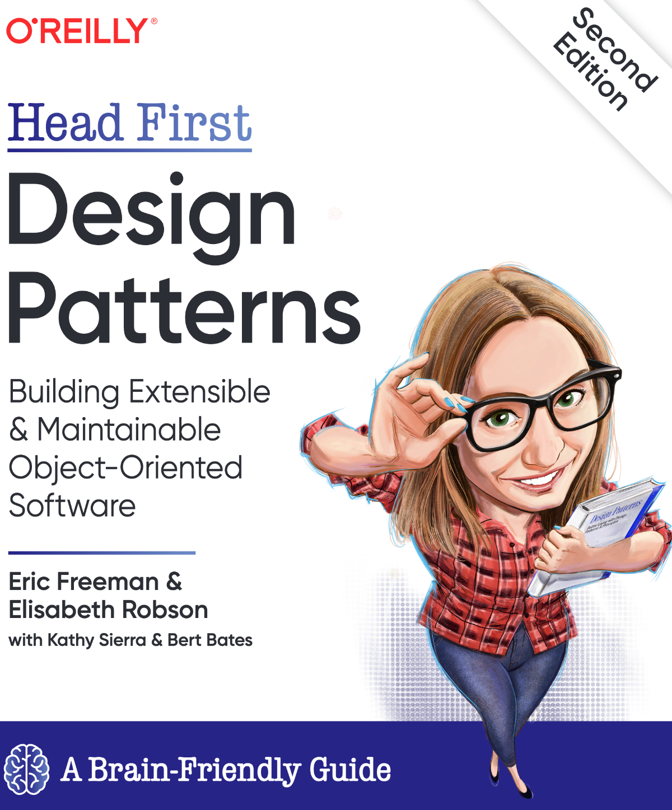
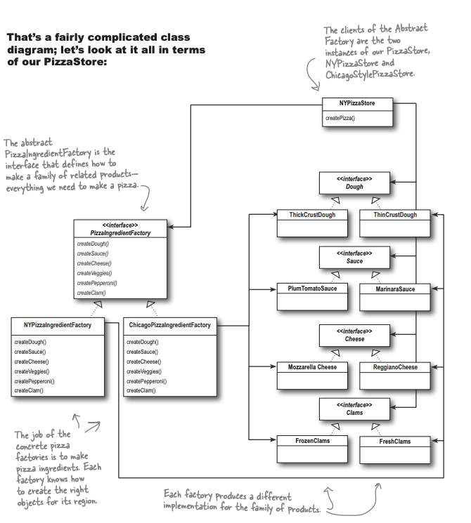

## Abstract Factory

### Fecha: 26/02/2025

- **Notas:**
  - Imaginemos que las franquicias siguen los procesos pero ahora cambian los ingredientes, no queremos eso. Construyamos una fábrica de ingredientes para asegurar solo ingredientes de calidad. Cada franquicia usa un conjunto/familia de ingredientes, distintos tipos de masa, salsa, queso, etc.
  -  La fábrica será responsable de crear cada ingrediente usando un método de creación. Usamos una intefaz para representar sus acciones, luego cada franquicia crea una subclase que implementa cada método de creación de cada ingrediente. Existirán un conjunto de clases representando cada ingrediente especifico. 
  
  - En la interfaz de pizza hacemos asbtracto el método de preparción ya que cada tipo de pizza lo implementará con los ingredientes necesarios, pero en lugar de que cada tipo de pizza instancie sus ingredientes especificos se los pedirá a la factory que le daremos en el constructor según la pizza store, la pizza store franquicia de NY le pasará a todos sus tipos de pizza la factory de ingredientes de NY. A la pizza no le interesa cuál fábrica se usa.
  
  
  - La abstract factory nos da una interfaz para crear una FAMILIA de PRODUCTOS. Podemos tener muchas factories que implementen muchas familias de productos con el desacoplamiento y posibilidad de intercambio ya que todas implementan la misma interfaz. También los clientes no les interesan los productos especificos, están desacoplados y solo les importan los tipos de productos (interfaces). 
  
  

- **Puntos clave:**
  - Todas las factories encapsulan creación de objetos. Son el único lugar para instanciar objetos concretos y dan desacople reduciendo dependencias entre clases.
  - La factory simple no es un patrón de diseño, solo una manera de abstraer.  
  - El factory method usa herencia, la abstract composición. 
  - Los métodos en la abstract factory para crear productos son factory methods que implementan las factories concretas.
  - El method crea un producto, la abstract un conjunto de productos. 
  
## Recursos Adicionales
- [Book](https://github.com/ajitpal/BookBank/blob/master/%5BO%60Reilly.%20Head%20First%5D%20-%20Head%20First%20Design%20Patterns%202nd%20Edition%20-%20%5BFreeman%5D.pdf)