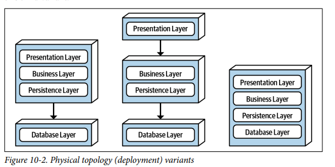
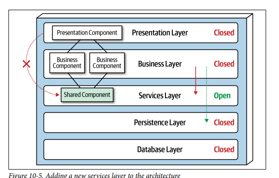
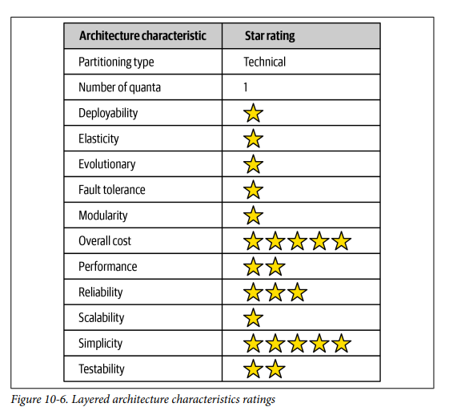

## Architecture Styles Layered

### Fecha: 23/08/2024

- **Notas:**
  - Layered o n-tier style, layer es para capas internas tier para capas físicas. facto estandar. Simplicidad, familiar y de bajo costo. Sigue la ley de Conway, copia la estructura de comunicación de una organización. Puede caer en muchos antipatrones como el de accidental arch. 
  - Componentes se organizan en capas logicas horizontales, cada capa tienen un rol especifico, no hay restricción en el número y tipos de capas pero la mayoria tiene 4: presentación, negocio, persistencia y base de datos. Muchas veces se combina negocio y persistencia. 
  - Tenemos varias perspectivas desde el punto de vista del despliegue, como single unit, front separado de back y de db o database separada solamente.
  
  - La separación de responsabilidades es el concepto clave, los componentes dentro de una layer están limitados en alcance, tratando solo con la lógica de la capa. El tradeoff es, generas buena separación, cohesión alta pero pierdes agilidad. 
  - Es de partición técnica y por tanto un business domain está esparcido por todas las capas. 
  - Cada capa puede ser abierta o cerrada, una cerrada significa que una request se mueve de arriba a abajo de capa en capa, sin saltos. En algunos casos puede ser que una request tan simple no necesite pasar por todas las capas y por eso necesitamos el concepto de capa abierta, que permite el paso sin tener que entrar a la capa.
  - El concepto layers of isolation significa que cambios hechos en una capa generalmente no impactan otros componentes en otras capas, no modifican los contratos de respuesta. Para soportar esto las capas envueltas en el trato de la mayoría de request deben ser cerradas, si la presentation puede acceder a la persistence entonces cambios en persistence afectaran a business y presentation. Esto genera mucho acoplamiento, fragilidad y dificultad en el cambio. Según este principio podemos reemplazar capas sin problema.
  - Agregar capas, suponga que tenemos objetos dentro de la busines con funcionalidades comúnes, si hay una decisión de que la presentation no debe acceder a estos objetos pues se vuelve complicado porque la presentation ya tiene acceso a la capa, la solución es añadir una capa abierta (aquí se hace el sentido pues es para poner una restricción).
    
  - Esta arquitectura es un buen punto de inicio, asegure que se reuse lo mínimo y que se mantenga la jerarquía en sus componentes. 
  - El antipatron sinkhole ocurre cuando las requests se mueven por todas las capas som hacer nada dentro de ellas. Toda arquitectura tiene algún escenario que cae aquí, lo importante es tener la regla del 80-20, solo aceptar el 20% de las requests como sinkhole, si se sube al 80% entonces no es el estilo correcto.
  - Buena para pequeñas aplicaciones, desarrollo web, punto de incio con limitantes en el presupuesto y muchas restricciones. Buena elección para cuando el arch sigue analizando pero debe empezar el desarrollo. Cuando empieza a crecer y mas caracteristicas son requeridas o se ve degradación entonces aquí se puede pensar en algo orientado a lo modular. 
  - Ratings:
  
  Costo y simplicidad a la cabeza.  
  Deployability baja porque es un monolito, alto riego y falta de frecuencia.  
  Testeabilidad baja también, un cambio hace correr todos los test suites.  
  Fiabilidad normal porque no hay tanto contacto con la red.  
  Elasticidad y escalabilidad bajas, falta de modularidad y deployabilidad explican esto. Las aplicaciones de single quanta solo pueden escalar hasta cierto punto. 
  Performance, falta de procesamiento en paralelo, closed layers y sinkhole.  
  No hay tolerancia a fallos.  
- **Preguntas:**
  - **1. What is the difference between an open layer and a closed layer?**  
  

    
Ver respuesta

    Ver arriba el detalle de las 8 falacias. 
  

  - **2. Describe the layers of isolation concept and what the benefits are of this concept.**  
  

    
Ver respuesta

    Logging, distributed trx, mantenimiento de contratos de respuesta. 
  

  - **3. What is the architecture sinkhole anti-pattern?**  
  

    
Ver respuesta

    Ese tipo de acoplado es cuando se pasa más información de la necesaria en la comunicación y por tanto usamos más ancho de banda generando más latencia.
  

  - **4. What are some of the main architecture characteristics that would drive you to use a layered architecture?**  
  

    
Ver respuesta

    Las soluciones son crear endpoints privados, usar selectores de campos como graphql, usar contratos value driven con contratos consumer driven (CDCs). Asegurar la minima cantidad de data posible.
  

  - **5. Why isn’t testability well supported in the layered architecture style?**  
  

    
Ver respuesta

    Las soluciones son crear endpoints privados, usar selectores de campos como graphql, usar contratos value driven con contratos consumer driven (CDCs). Asegurar la minima cantidad de data posible.
  

  - **6. Why isn’t agility well supported in the layered architecture style?**  
  

    
Ver respuesta

    Las soluciones son crear endpoints privados, usar selectores de campos como graphql, usar contratos value driven con contratos consumer driven (CDCs). Asegurar la minima cantidad de data posible.
  

## Recursos Adicionales
- [Course](https://fundamentalsofsoftwarearchitecture.com/)