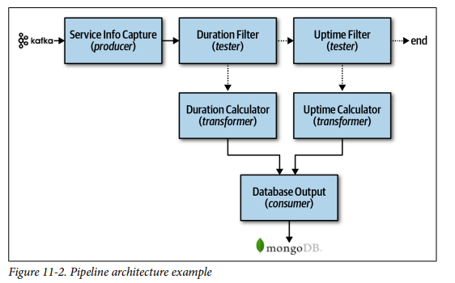
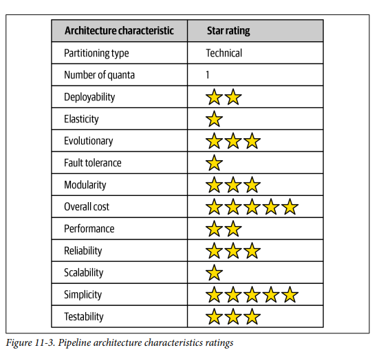

## Architecture Styles Pipeline

### Fecha: 23/08/2024

- **Notas:**
  - Pipeline o pipes and filters arch. Patrón cuando se parte las funcionalidades, es el principio que siguen los Unix terminal shell languages como Bash. Una vía de comunicación.
  - Pipes forman el canal de comunicación entre filtros, tipicamente unidireccionales y point to point (no broadcast) por performance. 
  - Filters son autocontenidos, independientes y stateless generalmente, cumplen con una única tarea. Tipos:  
    - Producer: El punto inicial del proceso, source. 
    - Transformer: Acepta input, hace una transformación de la data y saca output.
    - Tester: Acepta input, valida una condición y opcionalmente da output.
    - Consumer: Punto final del pipeline, aquí se puede persistir.
  - La unidirección y simplicidad hace que sean temas reusables y muy extensibles. Ejemplos son las ETL, los document type to another, Apache Camel. 
  
  - Ratings: 
  
  Es técnica porque se parte la lógica en filtros (tipo), monolito y por tanto single quanta.  
  Poco costo, muy simple.  
  Modular por la separación de responsabilidades entre varios tipos de filtros. Esto también influye en que sea testeable y deployable pero sigue siendo un monolito y por tanto muy normal.  
  Fiablidad media, elasticidad y escalabilidad muy bajas al ser un monolito.  
  No soporta tolerancia a fallos.   
- **Preguntas:**
  - **1. Can pipes be bidirectional in a pipeline architecture?**  
  

    
Ver respuesta

    No, son unidireccionales por la naturaleza secuancial del procesamiento.
  

  - **2. Name the four types of filters and their purpose.**  
  

    
Ver respuesta

    Ver arriba el detalle.
  

  - **3. Can a filter send data out through multiple pipes?**  
  

    
Ver respuesta

    Puede darse broadcast pero no se recomienda, point-to-point da performance.
  

  - **4. Is the pipeline architecture style technically partitioned or domain partitioned?**  
  

    
Ver respuesta

    Técnica, se divide la lógica en tipos de filtros, un artefacto técnico de la arquitectura.
  

  - **5. In what way does the pipeline architecture support modularity?**  
  

    
Ver respuesta

    En la separación de responsabilidades que se da con el uso de varios tipos  filtros para repartir la lógica.
  

  - **6. Provide two examples of the pipeline architecture style.**  
  

    
Ver respuesta

    Herramientas de ETLs, herramientas de .ext to .ext2.
  

## Recursos Adicionales
- [Course](https://fundamentalsofsoftwarearchitecture.com/)