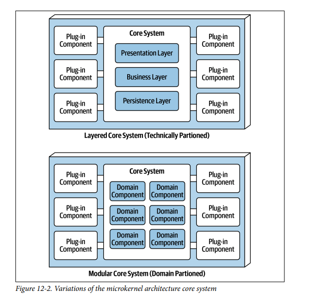
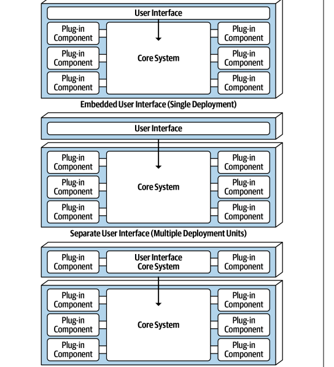
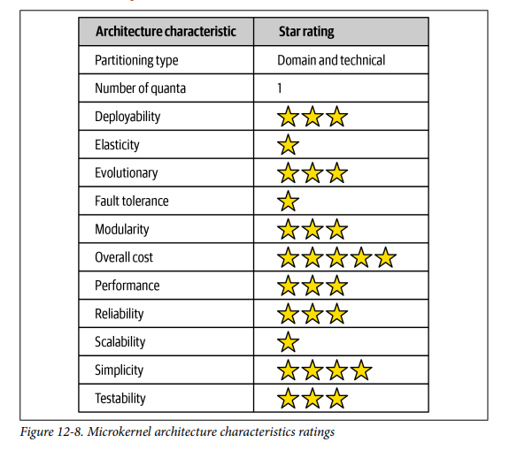

## Architecture Styles Microkernel

### Fecha: 25/08/2024

- **Notas:**
  - La arquitetcura de microkernel o plug-in es muy usada a día de hoy. Hace match con las aplicaciones de software basadas en productos, empacada y disponible para descragar e instalar como un single monolito deployment instalado en el sitio del producto.
  - Dos componentes principales, el core system y los plug-ins. La lógica se reparte en estos componentes dando mucha extensibilidad, adaptabilidad e isolation de features.
  - El core es la mínima cantidad de features para correr el sistema. Los IDE's son un buen ejemplo, core es abrir archivos, modificar texto y guardar. También se puede entender el core como el happy path del proceso general de la aplicación. Remover la cyclomatic complexity del core hacia los plugins incrementa la mantenibilidad y testeabilidad del código. Una aplicación de device recycling no va a poner todos los dispositivos en el core sino cada uno de ellos como un plug-in y en el core tendremos la localización e invocación del plug-in que corresponda. 
  - Dependiendo del tamaño y complejidad se puede implementar el core como un layered (técnico) o modular (funcionalidades) monolith, en algunos casos puede separarse también en varios deploy unit services con plugins especificos para cada uno. Es común que compartan una sola DB.  
  
  - La UI puede estar embeed o como otra deployment unit e incluso en la UI se puede implemntar plugins. 
  
  - Los plugins son standalone, independientes que contienen procesamiento especializado, features adicionales que extiendan al core. Pueden usarse para isolar codigo altamente volatil.
  - La comunicación core - plug es generalmente 1-1 con el pipe siendo una invocación de un método. Pueden ser compile-based o runtime-based. Pueden ser añadidos o removidos en runtime sin tener que redeplegar el core y se manejan a través de un framework como OSGi. Los compile-based son mucho más sencillos de manjear pero requieren redeploy. Pueden ser implementados como shared librarios (como JAR, DLL, Gem) pero lo más sencillo es otro paquete o namespace dentro de la misma base de código. 
  - La comunicación también puede ser con un remote access protocol con un plug-in como un standalone service pero esto sigue siendo single quanta por el monolito del cor, toda request debe ir al core antes de llegar al plug-in. Con esta alternativa hay mejor decoupling y permite async pero la transformación a lo distribuido por tanto mayor complejidad y costo. Debe analizarse muy bien si irse por esta alternativa de comunicación. 
  - No es común que cada plug-in se conecte a la bd compartida, en lugar de eos el core pasa toda la data necesaria para que el plug-in opere. Pero esto no limite que cada plug-in tenga su propia datastore a la que ellos acceden solamente. 
  - Registro de plugins, para que el core sepa cuales son los plugins y como acceder a ellos. Una manera común es hacer un registry de plugins, que tenga el nombre, data contracts y método de acceso. El registry puede ser tan simple como un struct map que pertenezca al core y tenga key-values de cada plugin o tan complejo como un discovery tool dentro del core o externa (Apche ZooKeeper). 
  - Los contratos entre plugin y core son estandar através de los dominios del plugin e incluyen input output data retornada. Contratos personalizados se dan cuando un tecero desarrolla el plugin y se recomienda realizar un adapter para que el core no tenga código especializado. 
  - Ratings: 
  
  Simplicidad y costo resaltan como layered (Monolito). 
  Escalabilidad, elasticidad y tolerancia a fallos sus debilidades (Monolito)  
  Tanto técnico como dominio en su partición, es único este estilo.  
  Test, deploy y fiabilidad estándar pero por encima gracias al isolate de plugins.  
  Modularidad y extensibilidad también resaltan porque el estilo permite agregar, remover y separar muy bien responsabilidades.  
  Performance normal porque suelen ser aplicaciones pequeñas que no crecen mucho como la mayoría de layereds. Además no sufren tanto de sinkhole porque se puede desconectar funcionalidad de manera sencilla. 
- **Preguntas:**
  - **1. What is another name for the microkernel architecture style?**  
  

    
Ver respuesta

    Plugin arch.
  

  - **2. Under what situations is it OK for plug-in components to be dependent on other plug-in components**  
  

    
Ver respuesta

    Yo pienso que en ninguna. La gracia de un plugin es su comportamiento isolated.
  

  - **3. What are some of the tools and frameworks that can be used to manage plug-ins?**  
  

    
Ver respuesta

    OSGi es un framework para el manejo de plugins.
  

  - **4. What would you do if you had a third-party plug-in that didn’t conform to the standard plug-in contract in the core system?**  
  

    
Ver respuesta

    Realizar un adapter entre mi contrato estandar y este contrato de tercero para que el core no tenga código especializado. 
  

  - **5. Provide two examples of the microkernel architecture style.**  
  

    
Ver respuesta

    Un IDE como VsCode y el ejemplo de la aplicación que recicla electronic devices y cada device es un plug-in.
  

  - **6. Is the microkernel architecture style technically partitioned or domain partitioned?**  
  

    
Ver respuesta

    Es muy especial porque el core puede ser partido de manera ténica como layers o por dominios.
  

  - **7. Why is the microkernel architecture always a single architecture quantum?**  
  

    
Ver respuesta

    Por el core, toda petición entra al core si o si así luego se diriga a un plugin por tanto un plugin por si solo no es quanta, todo es un single quanta.
  

  - **8. What is domain/architecture isomorphism**  
  

    
Ver respuesta

    El concepto de isomorfismo entre dominio y arquitectura se refiere a la correspondencia directa entre la estructura de un dominio y la estructura de la arquitectura del software. Es decir, las entidades de negocio (del dominio) se reflejan directamente en la arquitectura técnica del sistema. Podrías explicar que esto facilita la comprensión y el mantenimiento del sistema porque la estructura de la aplicación refleja de manera clara la lógica de negocio.
  

## Recursos Adicionales
- [Course](https://fundamentalsofsoftwarearchitecture.com/)