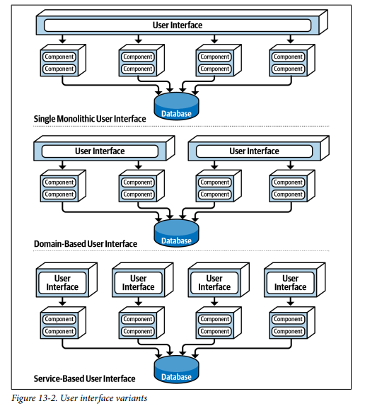
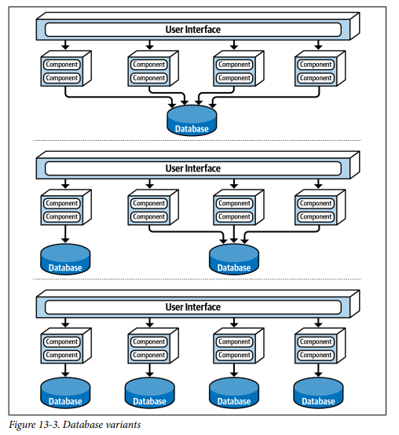
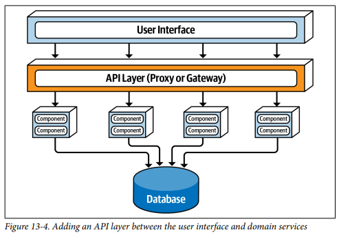
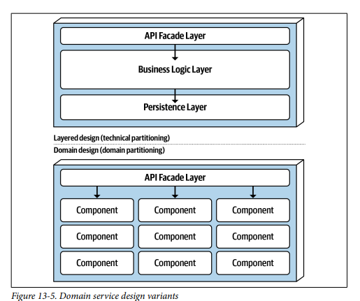
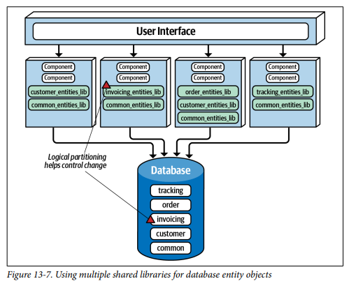

## Architecture Styles Service Based

### Fecha: 25/08/2024

- **Notas:**
  - Es un hibrido de miccroservicios y es una de las archs más pragmaticas y flexibles, de mucho enfoque práctico para solucionar problemas reales. No tiene el mismo nivel de costo y compeljidad que otras arquitecturas distribuidas.
  - La topología básica es un conjunto de macro capas distribuidas, separada la UI, separados los servicios y separada la db (monolitica) en cuanto a despliegue. 
  - Los servicios son de grano grueso, una buena porción de la lógica de la aplicación está allí, cada uno es independiente y self-deployed. Estos servicios se despliegan como en el monolito, usando war, assembly, etc, no es necesaria la contenerización pero tampoco se niega su uso (Docker). 
  - Como se comparte la DB, el número de servicios está en el rango de 4 a 12, 7 en promedio. Por el número no suele haber problemas de carga y cuellos de botella en DB pero si hay problemas con cambios en la base de datos.
  - Generalmente solo existe una instancia de cada domain service, pero por temas de escalabilidad pueden existir múltiples y debe haber una capacidad de load-balancing. 
  - Los servicios se acceden de manera remota, comunicación tipica con REST. Se puede usar una capa de API gateway, proxy pero generalmente la UI accede usando un service locator pattern directamente.
  - Hay muchas variantes de la topología: 
  
  - Pueden tenerse variantes en la cantidad de bases de datos, hasta el punto de una base de datos por servicio de dominio siempre y cuando una base de datos no sea requerida por más servicios, una partición de datos muy buena que evite la comunicación entre servicios y la duplicación de datos.
  
  - Puede añadirse una macro tier capa de API que sea un reverse proxy o gateway entre servicios y UI, buena práctica para exponer los servicios a otros sistemas. 
  
  - El diseño de cada servicio como componente puede ser partido de manera técnica o de dominio, en ambos casos se tiene una capa encima de todo de API, que permite la interacción con el servicio y maneja la request de negocio. Una request de un OrderService crea la orden, genera el ID, aplica el pago, y actualiza el inventario. Una de las diferencias con microservicios es que ese mismo flujo sería orquestado por distintos single-purpose services. 
  
  - Dentro de cada servicio podemos hacer uso de transacciones ACID, no como en microservicios que usariamos BASE y tendríamos consistencia eventual. Si se crea una orden y se rechaza el pago entonces en service-based una atomic trx y un rollback bastará para controlar la situación, en microservicios el fallo del PaymentService debe manejar esa data incosistente con los micros anteriores de Order, Inventory, etc. El grano grueso o coarse-grained permite por tanto mejor integridad de datos pero el trade/off es el manejo de cambios ya que un cambio en el OrderService va a requerir probar todo el proceso de Orden al no ser singular purpose, entre más cambio más fragilidad.
  - El coupling que se genera en la base de datos genera problema para hacer cambios en el schema, impactar todos los servicios haciendo un simple cambio en la bd es algo a lo que no se debe llegar. La peor manera de manejar esta arch es manejar a single sahred library de entity objects pues cada cambio va a requerir el cambio en la librería (conjunto de archivos de clases que representan los esquemas). Para mitigar esto lo mejor es particionar la bd y manifestar esta partición lógica a través de bibliotecas compartidas federadas, un cambio va a impactar solo los servicios que usen esa librería en especifico. Es importante resaltar la importancia de una shared lib common con tablas criticas. 
  
  - Realiza la partición lógica en la base de datos lo más detallada posible, manteniendo al mismo tiempo dominios de datos bien definidos, para controlar mejor los cambios en la base de datos dentro de una arquitectura basada en servicios.
  - Ratings: 
  
  Es particionada por dominio y los cambios se hacen sobre servicios en especifico.  
  El número de quanta es uno o más, a pesar de ser 4 o más servicios al compartir la base de datos y UI entonces el sistema completa sería un solo quanta, pero con las variaciones de varias UIs o BDs podemos tener varias quantas. 
  
  Partir en dominios permite mayor agilidad, mejor testeabilidad y más frecuencia en el deploy.  
  La tolerancia a fallos y disponibilidad se da pues a pesar de grano grueso al tener servicios self-contained y sin comunicación entre ellos. Si un servicio se cae, no impacta a los demás.  
  Aunque se puede escalar y volver elastico, al ser tan de grano grueso los servicios se replica mucha funcionalidad y esto no es efectivo en términos de costo.  
  El costo y simplicidad de esta arquitectura es muy buena en comparación con otras arquitecturas distribuidas.  
  Es más fiable pues el grano grueso hace que haya menos tráfico de red.  
  - Use esta arquitectura cuando necesite poder pero no tanto como una distribuida más compleja. Es natural cuando se está haciendo DDD. Preserva ACID y ofrece una muy buena modularidad sin entrar en granularidades muy pequeñas. Entre mayor granularidad más problemas al orquestar y coreografiar. Orquestar es coordinar múltiples servicios a través del uso de un servicio mediador separado que controla y maneja el flujo. Coreografiar es coordinar múltiples servicios sin un intermediario.
  
- **Preguntas:**
  - **1. How many services are there in a typical service-based architecture?**  
  

    
Ver respuesta

   Entre 4 y 12 servicios.
  

  - **2. Do you have to break apart a database in service-based architecture?**  
  

    
Ver respuesta

    No, el uso de una base de datos monolitica es parte de la topología común de esta arquitectura por el manejo completo de flujos en cada servicio y la no comunicación entre servicios. Sin embargo, se pueden utilizar varias bases de datos.
  

  - **3. Under what circumstances might you want to break apart a database?**  
  

    
Ver respuesta

    Ayuda...
  

  - **4. What technique can you use to manage database changes within a service-based architecture?**  
  

    
Ver respuesta

    Generar varias librerias compartidas federadas para el manejo de entidades de la base de datos acordes a las particiones lógicas de los datos lo más finas posibles, así un cambio se mitiga y afecta solo a los servicios que usan esa lib.
  

  - **5. Do domain services require a container (such as Docker) to run?**  
  

    
Ver respuesta

    No, pueden ser desplegados de la manera que se despliega un monolito pero no está prohibida la contenerización.
  

  - **6. Which architecture characteristics are well supported by the service-based architecture style?**  
  

    
Ver respuesta

    Agilidad (Deploy + Test), tolerancia a fallos, modularidad, costo, fiabilidad.
  

  - **7. Why isn’t elasticity well supported in a service-based architecture?**  
  

    
Ver respuesta

    Por los servicios de grano grueso, a pesar de poder escalar y ser elasticos al ser tanta funcionalidad replicada no es algo eficiente en costos.
  

  - **8. How can you increase the number of architecture quanta in a service-based architecture?**  
  

    
Ver respuesta

    Si en los servicios algunos dejan de compartir base de datos y UI y generan otro subsistema que funcione por si mismo entonces tenemos multiple quanta.
  

## Recursos Adicionales
- [Course](https://fundamentalsofsoftwarearchitecture.com/)