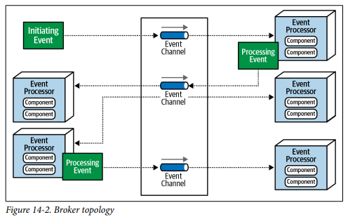
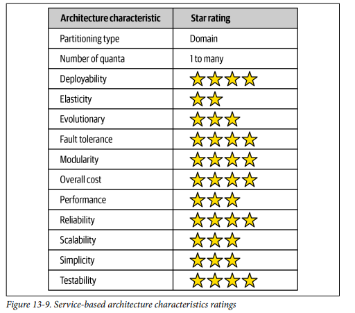
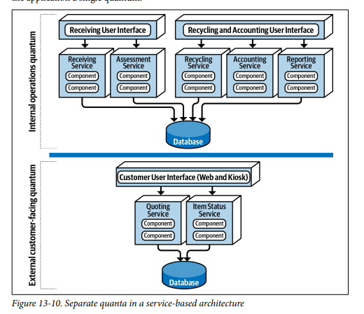

## Architecture Styles Event Driven

### Fecha: 08/09/2024

- **Notas:**
  - Es un estilo popular distribuido y async para producir aplicaciones altamente escalables y de alto performance. Puede ser usado para pequeñas y grandes aplicaciones. Está compuesta de procesadores de eventos desacoplados que reciben y procesan el evento de manera async. Puede ser usado el estilo como standalone o dentro de otros estilos. 
  - La mayoría de aplicaciones siguen el request-based model, request hechas al sistema para hacer x acción son enviadas al orquestador de requests, tipicamente una UI o un API, este deterministicamente y sincronamente dirige la request a los procesadores de request. Los procesadores de request se encargan del manejo y de entregar o actualizar la data. Un ejemplo es devolver el historial de compras de hace seis meses, es una request data-driven deterministica hecha al sistema en un contexto, no un evento que sucede al que se debe reaccionar. 
  -  Un event-based model reacciona a situaciones y toma acción basado en el evento, por ejemplo hacer una bid en una auction, no es una request es más bien un evento que sucede después de anunciar el precio base.
  - La topología tiene dos formas primarias, mediator y broker. Mediator se usa cuando se requiere control sobre el flujo y broker para mayor responsividad y control dinamico del manejo de un evento. 
  - Broker, no tienen un mediador de eventos centralizado, el flujo del msg se distribuye a través de los procesadores de eventos utilizando un broker como RabbitMQ, muy útil para flujos de eventos simples que no requieren coordinación ni orquestación. Hay 4 componentes principales: 
    - Evento inicial que inicia todo el flujo de eventos, tan simple o complejo como la bid, enviado a través de un canal en el broker. Lo recibe UN solo event processor que inicia con los manejos. 
    - Evento broker como RabbitMQ para el manejo de msgs. 
    - Event proccesor, realiza tareas especificas y luego de manera async notifica al resto del sistema de lo que hizo creando un evento de procesamiento. 
    - El evento de procesamiento se envia al broker para mayor procesamiento si es necesario, otros processors pueden o no escuchar este evento y actuar. Así hasta que nadie se interese en lo que el último processor hizo. 
  - Es usualmente federeado (multiples instancias domain-based clustered) en donde cada broker contiene todos los canales de eventos usados dentro del flujo de eventos de ese dominio. Por tanto los topics (broadcast) es usado con un modelo de pub/sub. 
  - Es buena práctica que cada processor advierta de lo que hizo para dar mayor extensibilidad a un nuevo processor que se interese en eso. 
  - Distintos procesamientos se pueden dar en paralelo, alto performance.
  
  - Ratings: 
  
  Es particionada por dominio y los cambios se hacen sobre servicios en especifico.  
  El número de quanta es uno o más, a pesar de ser 4 o más servicios al compartir la base de datos y UI entonces el sistema completa sería un solo quanta, pero con las variaciones de varias UIs o BDs podemos tener varias quantas. 
  
  Partir en dominios permite mayor agilidad, mejor testeabilidad y más frecuencia en el deploy.  
  La tolerancia a fallos y disponibilidad se da pues a pesar de grano grueso al tener servicios self-contained y sin comunicación entre ellos. Si un servicio se cae, no impacta a los demás.  
  Aunque se puede escalar y volver elastico, al ser tan de grano grueso los servicios se replica mucha funcionalidad y esto no es efectivo en términos de costo.  
  El costo y simplicidad de esta arquitectura es muy buena en comparación con otras arquitecturas distribuidas.  
  Es más fiable pues el grano grueso hace que haya menos tráfico de red.  
  - Use esta arquitectura cuando necesite poder pero no tanto como una distribuida más compleja. Es natural cuando se está haciendo DDD. Preserva ACID y ofrece una muy buena modularidad sin entrar en granularidades muy pequeñas. Entre mayor granularidad más problemas al orquestar y coreografiar. Orquestar es coordinar múltiples servicios a través del uso de un servicio mediador separado que controla y maneja el flujo. Coreografiar es coordinar múltiples servicios sin un intermediario.
  
- **Preguntas:**
  - **1. How many services are there in a typical service-based architecture?**  
  

    
Ver respuesta

   Entre 4 y 12 servicios.
  

  - **2. Do you have to break apart a database in service-based architecture?**  
  

    
Ver respuesta

    No, el uso de una base de datos monolitica es parte de la topología común de esta arquitectura por el manejo completo de flujos en cada servicio y la no comunicación entre servicios. Sin embargo, se pueden utilizar varias bases de datos.
  

  - **3. Under what circumstances might you want to break apart a database?**  
  

    
Ver respuesta

    Podrías considerar descomponer una base de datos si necesitas aislar dominios de datos para mejorar la escalabilidad, facilitar el mantenimiento, o si ciertos servicios requieren una alta disponibilidad independiente de otros servicios.
  

  - **4. What technique can you use to manage database changes within a service-based architecture?**  
  

    
Ver respuesta

    Generar varias librerias compartidas federadas para el manejo de entidades de la base de datos acordes a las particiones lógicas de los datos lo más finas posibles, así un cambio se mitiga y afecta solo a los servicios que usan esa lib.
  

  - **5. Do domain services require a container (such as Docker) to run?**  
  

    
Ver respuesta

    No, pueden ser desplegados de la manera que se despliega un monolito pero no está prohibida la contenerización.
  

  - **6. Which architecture characteristics are well supported by the service-based architecture style?**  
  

    
Ver respuesta

    Agilidad (Deploy + Test), tolerancia a fallos, modularidad, costo, fiabilidad.
  

  - **7. Why isn’t elasticity well supported in a service-based architecture?**  
  

    
Ver respuesta

    Por los servicios de grano grueso, a pesar de poder escalar y ser elasticos al ser tanta funcionalidad replicada no es algo eficiente en costos.
  

  - **8. How can you increase the number of architecture quanta in a service-based architecture?**  
  

    
Ver respuesta

    Si en los servicios algunos dejan de compartir base de datos y UI y generan otro subsistema que funcione por si mismo entonces tenemos multiple quanta.
  

## Recursos Adicionales
- [Course](https://fundamentalsofsoftwarearchitecture.com/)