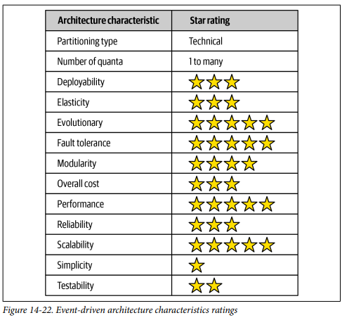

## Architecture Styles Event Driven

### Fecha: 08/09/2024

- **Notas:**
  - Es un estilo popular distribuido y async para producir aplicaciones altamente escalables y de alto performance. Puede ser usado para pequeñas y grandes aplicaciones. Está compuesta de procesadores de eventos desacoplados que reciben y procesan el evento de manera async. Puede ser usado el estilo como standalone o dentro de otros estilos. 
  - La mayoría de aplicaciones siguen el request-based model, request hechas al sistema para hacer x acción son enviadas al orquestador de requests, tipicamente una UI o un API, este deterministicamente y sincronamente dirige la request a los procesadores de request. Los procesadores de request se encargan del manejo y de entregar o actualizar la data. Un ejemplo es devolver el historial de compras de hace seis meses, es una request data-driven deterministica hecha al sistema en un contexto, no un evento que sucede al que se debe reaccionar. 
  -  Un event-based model reacciona a situaciones y toma acción basado en el evento, por ejemplo hacer una bid en una auction, no es una request es más bien un evento que sucede después de anunciar el precio base.
  - La topología tiene dos formas primarias, mediator y broker. Mediator se usa cuando se requiere control sobre el flujo y broker para mayor responsividad y control dinamico del manejo de un evento. 
  - Broker, no tienen un mediador de eventos centralizado, el flujo del msg se distribuye a través de los procesadores de eventos utilizando un broker como RabbitMQ, muy útil para flujos de eventos simples que no requieren coordinación ni orquestación. Hay 4 componentes principales: 
    - Evento inicial que inicia todo el flujo de eventos, tan simple o complejo como la bid, enviado a través de un canal en el broker. Lo recibe UN solo event processor que inicia con los manejos. 
    - Evento broker como RabbitMQ para el manejo de msgs. 
    - Event proccesor, realiza tareas especificas y luego de manera async notifica al resto del sistema de lo que hizo creando un evento de procesamiento. 
    - El evento de procesamiento se envia al broker para mayor procesamiento si es necesario, otros processors pueden o no escuchar este evento y actuar. Así hasta que nadie se interese en lo que el último processor hizo. 
  - Es usualmente federeado (multiples instancias domain-based clustered) en donde cada broker contiene todos los canales de eventos usados dentro del flujo de eventos de ese dominio. Por tanto los topics (canales en el broker de msg) es usado con un modelo de pub/sub hasta para broadcast. 
  - Es buena práctica que cada processor advierta de lo que hizo para dar mayor extensibilidad a un nuevo processor que se interese en eso. 
  - Distintos procesamientos se pueden dar en paralelo, alto performance. Muy desacoplados todos los processors, es una carrera de relevos. Cada processor puede escalar de manera independiente y si un procesador de eventos se ralentiza o se detiene (debido a problemas en el entorno o sobrecarga), el topic actúa como un buffer o punto de "backpressure". Los eventos se acumulan en el topic hasta que el procesador pueda ponerse al día o hasta que se resuelva el problema. Esto previene que los eventos se pierdan y permite que el sistema mantenga su integridad.
  
  
  - Hay algunos aspectos negativos como el no control sobre el flujo asociado al evento de inicio, nadie en el sistema sabe cuando la trx está completa. El manejo de errores es otro problema complicado, un fallo y nadie está pendiente de el, se puede trabar hasta un arreglo automatico o manual. La recuperabilidad es compleja porque otros processors han actuado y no podemos reiniciar desde un inicio una trx.  
  
  - Mediator, aquí existe un componente central que es el event mediator, que maneja y controla el flujo para eventos iniciales que requieren la coordinación de múltiples procesadores de eventos. Los componentes son eventos iniciales, cola de eventos, event mediator, event channels (topics) y procesadores de eventos.
  - El evento inicial inicia el flujo, se envía a una cola de eventos inicial que es aceptada o consumida por el mediator, este solo conoce los pasos en el proceso del evento y por tanto genera los eventos dirigidos a canales de eventos especializados (usualmente colas) de manera 1-1. Los procesadores escuchan esos canales dedicados procesan y responden nuevamente al mediator (no al resto del sistema).
  
  - En la mayoría de implementaciones de esta topología se cuenta con distintos mediatos asociados a un dominio o grupo de eventos. Esto reduce el single point of failure y aumenta el performance y thoughput. 
  - El mediator se puede implementar de muchas formas, para eventos simples Apache Camel, Mule ESB que por dentro tienen código escrito en lenguajes de proposito general para el manejo del flujo. Si se necesita un montón de complejidad entonces Apache ODE, Oracle BEPL que usan el BPEL un lenguaje XML-like poderoso pero complejo. Para aquellos flujos que necesitan intervención humana entonces jBPM. Es importante conocer el tipo de eventos para tomar una decisión correcta, como es raro tener eventos todos de una misma complejidad puede generarse un mediator simple antes de todos que según la complejidad del evento evento lo lleve al mediator adecuado. Este mediator simple puede ser responsable de conocer el estado de todos los eventos o delegar eso a cada mediator.
  
  - En un ejemplo de evento tenemos los pasos que conoce el mediator y dentro de esos pasos eventos que ocurren de manera simultanéa, sin embargo, para pasar al siguiente paso el mediator espera el ack de cada uno de esos eventos.
  
  
  - El mediator tiene conocimiento y control del flujo por tanto mantiene el estado de los eventos, puede manejar errores, recuperarlos y reiniciarlos. Difiere del broker en esto y en que los eventos eran cosas que ocurren en el sistema aquí son más bien comandos, cosas que deben hacerse y no pueden ser ignoradas.
  - Es dificil modelar declarativamente procesamientos dinamicos que ocurren en flujos de eventos complejos por tanto muchas veces hay un hibrido entre mediator para procesamiento general y broker para naturaleza dinamica compleja de eventos. 
  - El mediator también escala pero es más propenso a cuellos de botella y también implica que no hay tanto desacoplamiento y performance como en el broker. Escoja entre control y manejo de errores contra performance y escalabilidad (a mayor nivel).
  
  - En general, esta arch ofrece una capacidad única y es que toda la comunicación se sostiene en async, tanto para no response required como para request/reply process. Esto es muy poderoso para manejar la responsividad del sistema. En el ejemplo se ve como de 3100ms de respuesta podemos pasar a 25ms claro con la perspectiva de que ya se hizo cuando se está procesando por debajo. Por qué hacer al usuario esperar si no necesita la respuesta?. La diferencia de responsiveness y performance es que el performance se mejora tomando todo el proceso end-to-end en cambio la respuesta puede mejorarse solo acelerando la notificación de aceptado. 
  
  - Para el manejo de errores, se puede seguir el patron workflow event pattern of reactive arch, en donde logramos tanto responsividad como resiliencia. Aquí delgeamos a un workflow processor delegate, el producer de events pasa data async a un canal al consumer, si el consumer tiene un error mientras procesa la data entonces de manera inmediata delega al worflow processor y continua consumiendo nuevos msgs. El procesador de workflow recibe y mira cual es el error en el msg, de manera programada (sin intervención humana) el processor cambia el msg y lo manda de nuevo a la cola de origen. Cuando no puede determinar el error entonces lo manda a otra cola que es consumida por un "dashboard" en donde un humano revisa y lo arregla para volverlo a mandar a la cola origen.
  
  - Para prevenir la pérdida de datos (msgs borrados o nunca llegando a su destino) identificamos las 3 áreas de perdida y la solución de cada una. 
    - De processor A a la cola. Solución: Persisten messahge queues y sync send a la cola. 
    - De la cola a processor B. Solución: Ack mode de los msgs.
    - De processor B a la DB. Solución: ACID trx y LPS, eliminando el msg de la cola persistente luego de haberlo persistido en la BD con trxs.
  
  - Las capacidades broadcast para transmitir a varios sin saber quienes son es única en esta arch. Es el mayor nivel de desacoplamiento y es un patrón de consistencia eventual y de procesamiento de eventos complejos. 
  - Si se necesita confirmación de respuesta sync (request/reply process), cada canal constará de una cola de request y otra de reply en donde el producer hace un bloqueo de espera hasta obtener la respuesta, existen dos maneras principales de lograrlo: 
    - Correlation ID en el header del msg en donde se coloca el ID inicial del request. 
    - Cola temporal dedicada a la request especifica que vive mientras dure el request/reply.
  Se recomienda más el ID ya que mucho procesamiento de msgs incurre en más recursos en el broker creando y eliminando colas.
  
  
  - Es importante entender cuando escoger request based y event based, el request para bien estructuradas, data-driven requests que necesitan certeza y control mientras que event para flexibles, action-based eventos que requieren altos niveles de responsividad y escalamiento con procesamiento complejo y dinamico. Esta arch ayuda a remover cuellos de botella, da un back pressure point (acumulación de eventos) y da una responsividad única.
  
  - Ratings: 
  
  Es particionada tecnicamente ya que los dominios están repartidos en los processors y la separación de componentes por tipos es lo que une.  
  El número de quanta es uno o más, basado en las interacciones con la base de datos en cada processor, si multiples processors comparten una bd entonces pertenecen al mismo quantum. 
  Partir en dominios permite mayor agilidad, mejor testeabilidad y más frecuencia en el deploy.  
  Alto performance gracias al async con el procesamiento paralelo.  
  Alta escalabilidad al escalar cada processor de manera independiente.  
  Tolerancia a fallos por el desacoplamiento y manejo async que da consistencia eventual.  
  Simplicidad y testeabilidad bajas por el dinamismo de los flujos.  
  Muy evolucionaria y expandible, se añaden processors y funcionalidades de manera rápida.  
- **Preguntas:**
  - **1. What are the primary differences between the broker and mediator topologies?**  
  

    
Ver respuesta

   La existencia del mediador para el conocimiento del flujo, coordinación y orquestación, manejo de errores, recuperabilidad y capacidad de reinicio de los eventos. En broker los eventos pueden ser ignorados y son reportados al resto del sistema, en mediator son mas comandos delegados que deben cumplirse y son reportados solo al mediator.
  

  - **2. For better workflow control, would you use the mediator or broker topology?**  
  

    
Ver respuesta

    Mediator que conoce el flujo y puede rastrear el estado de los eventos.
  

  - **3. Does the broker topology usually leverage a publish-and-subscribe model with topics or a point-to-point model with queues?**  
  

    
Ver respuesta

    Broker usa pub/sub con topics ya que transmite notificaciones de procesamiento al resto del sistema mientras que mediator usa colas 1-1 con cada processor especializado.
  

  - **4. Name two primary advantage of asynchronous communications**  
  

    
Ver respuesta

    La responsividad con respuestas rápidas y performance con procesos paralelos.
  

  - **5. Give an example of a typical request within the request-based model**  
  

    
Ver respuesta

    Obtener los datos de un perfil o el detalle de una transacción.
  

  - **6. Give an example of a typical request in an event-based model.**  
  

    
Ver respuesta

    Hacer un pago en un ecommerce o modificar el estado civil en la registraduría.
  

  - **7. What is the difference between an initiating event and a processing event in event-driven architecture?**  
  

    
Ver respuesta

    El evento inicial ocurre para dar inicio al flujo de procesamiento del evento emitido por una UI o API que lo transmite a los processors, mientras que el de procesamiento es un evento que emite el event processor dirigido a otros processors para notificar su trabajo completado y continuar con el flujo.
  

  - **8. What are some of the techniques for preventing data loss when sending and receiving messages from a queue?**  
  

    
Ver respuesta

    Colas persistentes y msgs persistentes, ACID, LPS, ACK mode.
  

  - **9. What are three main driving architecture characteristics for using event-driven architecture?**  
  

    
Ver respuesta

    Escalabilidad, performance, tolerancia a fallos.
  

  - **10. What are some of the architecture characteristics that are not well supported in event-driven architecture?**  
  

    
Ver respuesta

    Simplicidad, testeabilidad, costo, predictibilidad.
  

## Recursos Adicionales
- [Course](https://fundamentalsofsoftwarearchitecture.com/)