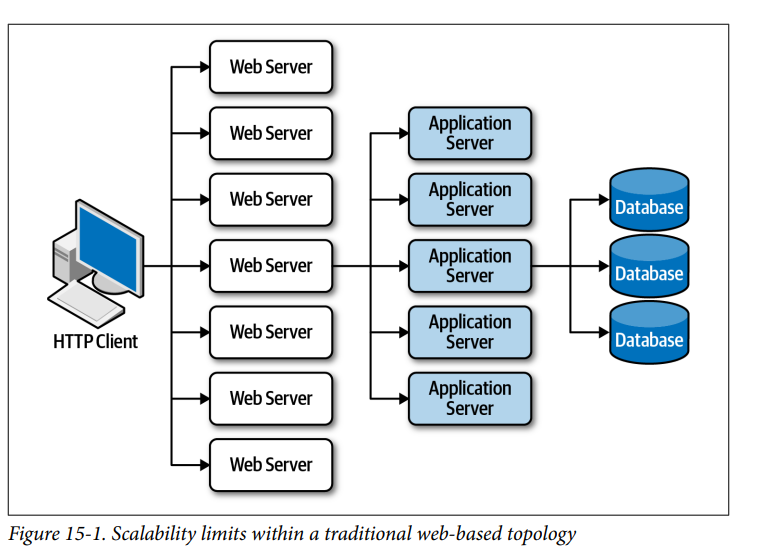
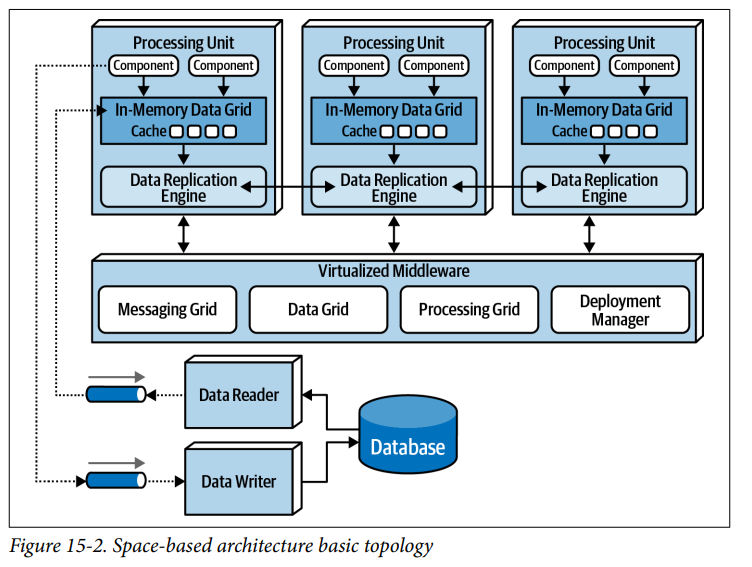
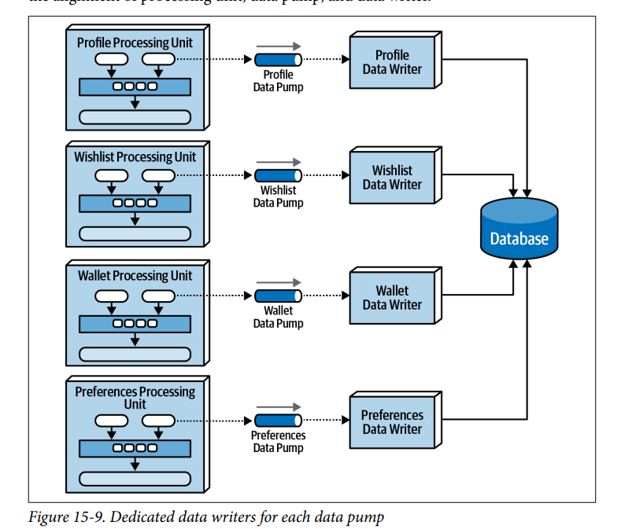
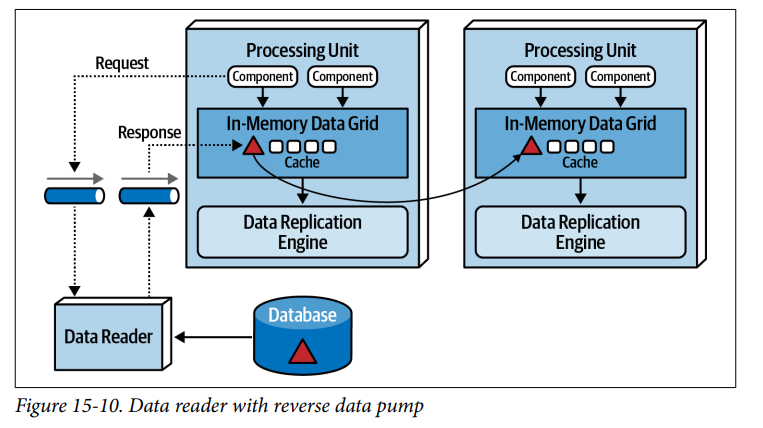
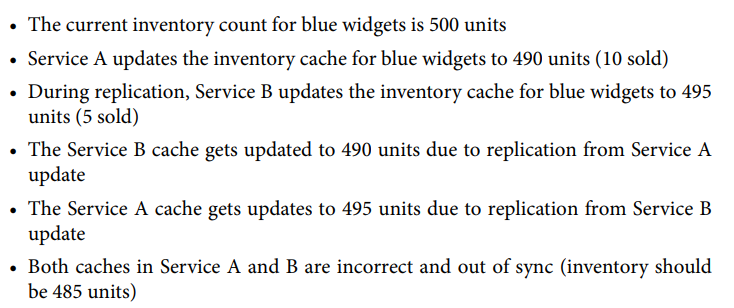
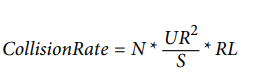
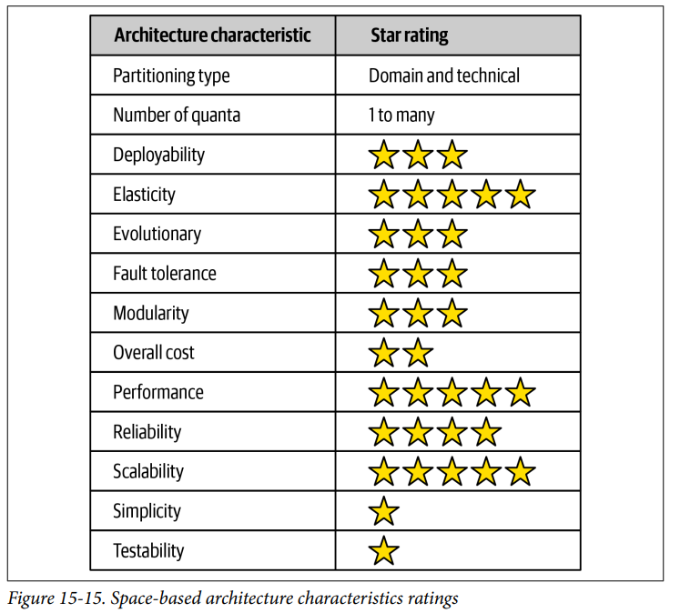

## Architecture Styles Space Based

### Fecha: 11/09/2024

- **Notas:**
  - La mayoría de web apps sigue el mismo flujo general: web-app-db. Los cuellos de botella empiezan a existir a medida que la carga de usuarios aumenta, escalar el web server que es fácil hace cuello en app que escalarlo es posible pero más complejo y llega el cuello a la db que es mucho más compleja y costosa de escalar. Se termina con el antipattern de triangule shaped topology. Escalar una app normal para montones de usuarios (condiciones extremas) es muy complicado.
  
  - Space-based está diseñada para soportar alta escalabilidad, elasticidad y concurrencias, es útil para apps que tienen número no tan predecibles de usuarios concurrentes y soluciona el problema de escalado sin ir a mejorar los recursos de una db o meter cachés a una arch no escalable. 
  - Obtiene su nombre del concepto de tuple space, la técnica que usa multiples procesadores paralelos comunicandolos usando la memoria compartida. Se logra escalabilidad, elasticidad y performance quitando una referencia centra de db y usando in-memory data grids replicadas. La data se queda en esa memoria y es replicada en las otras unidades de proceso, cuando una unidad de proceso actualiza la data manda async la data a la db usualmente con colas, las unidades de proceso se prenden y apagan dinamicamente según la carga, esto elimina los cuellos de botella porque no hay db central y da escalabilidad ilimitada. 
  - Los componentes son: 
    - Unidad de proceso: contiene el código. 
    - Middleware virtualizado: coordina y administra las unidades. 
    - Data pumps: A través de estos se envian los cambios async a la db. 
    - Data writers: Realizan operaciones de escritura sobre la db. 
    - Data readers: Leen de la db y entregan a las unidades. 
  
  - La unidad contiene la lógica, usualmente contiene los componentes web así como el back. Puede repartirse la lógica en varias unidades dependiendo del caso. Contiene una in-memory data grid y un replication engine como HazelCast, Apache Ignite o Oracle Coherence.
  - El middleware maneja los temas de infraestructura, contiene estos componentes que pueden ser escritos o adquiridos.
    - Messaging grid: Maneja los input request y la sesión de estado, determina que unidad está disponible para manejar la request, su complejidad puede ser un simple round-robin o algo más complejo que haga track de cada unidad su estado con una request, etc. Usualmente implementada con HA Proxy o Nginx.
    - Data grid: Es crucial en la arch, implementada actualmente como caché replicada. Sin embargo, para un contorlador necesario o para caché distribuido este componente reside tanto en middleware como en cada unidad. Es crucial que cada unidad tenga su memoria con los mismos datos que las otras, esa replicación se hace sync y de manera rápida, menos de 100ms. Una unidad puede tener cuantas caches necesite para hacer sus tareas o puede pedir esta info o delegar la tarea a otra unidad pero requeriendo coreografia y orquestación. Esta replicación permite que si hay al menos una unidad de caché activa entonces las otras unidades puedan leer de ahí. Cada unidad conoce de las otras a través de una member list que tiene la iP y puertos de las unidades que usan la misma cache. Cuando una unidad actualice la cache entonces la data grid, HazelCat u otra conoce los miembros (están declarados todos los miembros de una cache en cada unidad que usa esa cache) y realiza async la replicación. Cuando una unidad de baja entonces las otras de manera auto reflejan esa perdida en su lista de miembros.
    - Processing grid: Es opcional, se encarga de orquestar a las unidades requeridas en una request. 
    - Deployment manager: Encargado de encender y apagar unidades según la carga, es clave para la escalabilidad y elasticidad del sistema. 
  - Data pumps, manera de enviar data async (consistencia eventual) a otro procesador para que actualice la data en la db. Necesario ya que las unidades no leen o escriben directo de la db. Cuando una unidad recibe y procesa una request entonces es la responsable de enviar el update a través del data pump. Usualmente implementados con messaging, ya que hay garantía de entrega y de orden, también genera desacoplamiento entre la unidad y el data writer que si no está disponible van a luego pasarle las actualizaciones. En la mayoría hay varios pumps, uno dedicado a cada domain o puede ser dedicado a cada caché o a cada unit domain. Tienen contratos asociados con la acción, las actualizaciones solo llevan la data a actualizar.
  - Los data writers aceptan msgs del pump y usan el contrato para realizar una acción en la db, puede ser implementado como una app, servicio, hub. La granularidad depende. Recomiendan un pump por unidad y un writer por pump, escala mejor.
  
  - Data reader lee de la db y manda a la unidad usando un reverse pump, solo se invocan si hay una caida de todas las unidades de un mismo cache, redeploy de todas las unidades de un mismo cache o dar data archivada que no está en la cache replicada. Cuando se cae todo, se lee de la db y cuando empieza a subir la primera que establezca alcance con la cache se convierte en la dueña temporal, las otras entran en espera, la dueña manda msg con request de data y el reader acepta el request y manda a través de una cola distinta, la unidad escucha de la cola reverse, carga y se sync las caches de las otras. Pueden ser domain-based o dedicadas a una unidad. 
  
  - Writers + Readers hacen la data abstraction layer. Data access layer unidades coupled a la estructura de los datos, Data abstraction layer unidades decoupled de la estructura. Space based usa abstraction. Permite cambio incremental en las unidades, los readers y writers son los encargados de elaborar funciones de transformación para cumplir con los contratos si las cosas en la estructura cambian hasta que se cambien los contratos. 
  - Las colisiones son algo que puede ocurrir con la replicación de cache, dos unidades quedan con data desync e incorrecta. 
  
  
  Se determina la probabilidad con una fórmula en donde N son las instancias que usan la cache, UR es la tasa de actualización, S el tamaño de la cache y RL la latencia de replicación (si se desconoce se puede asumir 100ms). El cache zie es la unica inversamente proporcional a la prob de colisión, entre más pequeño más probable. Como las updates rates varian es bueno hacer picos altos y bajos para determinar la viabilidad de esta arch. Se buscan % de menos de 0.1.
  - Esta arch se puede implementar en cloud o on prem o en ambas, poderoso tener unidades y middle en cloud y la db on prem para mantenerlas cerca.
  - Cache distribuido, algunos casos cuando hay high data volumes y high update rates, memorias internas con valores mayores a 100MB en cada unidad pueden empezar a provocar problemas, una high rate hace que el data grid no pueda mantenerse al día y se pierde la consistencia. Este método requiere un servidor externo que centraliza la caché, las unidades no guardan en la memoria interna sino que acceden de manera remota al server, esto da más consistencia ya que no se tiene replicación, pero menos performance por la request de acceso que da más latencia. La tolerancia a fallos que tenía la replicated también se afecta, antes teníamos varios puntos de fallo ahora solo este. Puede mitigarse mirroring la cache. Consistencia vs performance y tolerancia a fallos, se decide con el tamaño y la rate de update. Ambos modelos son aplicables en un near-cache model pero no se recomienda en esta arch.
  - Un sistema de ticket de conciertos o un sistema de subastas son ejemplos que encajan en esta arch.
  - Ratings: 
  
  Performance, escalabilidad y elasticidad son sus fuertes al remover la db central y usar cache in-memory.  
  No es para nada simple, el uso de cache, consistencia eventual, colisiones son unos factores. 
  Testing complicado, no es sencillo simular los niveles de concurrencia necesarios, pruebas en caliente en prod.  
  Es costosa, servicios de terceros, alta utilización de cloud y on prem.  
  Es tanto tecnica como dominio. Dominio por la flexibilidad de las unidades que pueden actuar como service-based. Tecnica porque separa las responsabilidades claramente en los distintos componentes.  
  Quanta 1 a muchos, depende de la UI y de la comunicación entre unidades, si se quita la db igual si una request asocia varias unidades pues misma quanta para ellas.  
- **Preguntas:**
  - **1. Where does space-based architecture get its name from?**  
  

    
Ver respuesta

   De tuple space, técnica para comunicar procesos en paralelo usando la memoria compartida.
  

  - **2. What is a primary aspect of space-based architecture that differentiates it from other architecture styles?**  
  

    
Ver respuesta

    Desaparace la base de datos centralizada y las consultas sync a esta. 
  

  - **3. Name the four components that make up the virtualized middleware within a space-based architecture.**  
  

    
Ver respuesta

    Messaging grid, data grid, processing grid, deployment manager.
  

  - **4. What is the role of the messaging grid?**  
  

    
Ver respuesta

    Maneja las inputs y las distribuye a las unidades disponibles, puede ser más complejo y conocer el estado de request/unidad.
  

  - **5. What is the role of a data writer in space-based architecture?**  
  

    
Ver respuesta

    Escucha del data pump las actualizaciones de data que deben realizarse mediante un contrato de acción definida y realiza estos cambios de manera async.
  

  - **6. Under what conditions would a service need to access data through the data reader?**  
  

    
Ver respuesta

    Caida de todas las unidades asociadas a una cache, redeploy y data archivada que no está en cache.
  

  - **7. Does a small cache size increase or decrease the chances for a data collision?**  
  

    
Ver respuesta

    Incrementa, entre más pequeña más probable.
  

  - **8. What is the difference between a replicated cache and a distributed cache? Which one is typically used in space-based architecture?**  
  

    
Ver respuesta

    tipicamente replicada, in-memory grids en cada unidad replicadas por el data grid, en distributed un server central accedido por las unidades, la decisión se toma según el tamaño y update rate, es performance y tolerancia vs consistencia.
  

  - **9.List three of the most strongly supported architecture characteristics in space based architecture**  
  

    
Ver respuesta

    Escalabilidad, elasticidad y performance.
  

  - **10. Why does testability rate so low for space-based architecture?**  
  

    
Ver respuesta

    Es dificil testear los niveles de concurrencia tan extremos, pruebas en caliente en prod. 
  

## Recursos Adicionales
- [Course](https://fundamentalsofsoftwarearchitecture.com/)