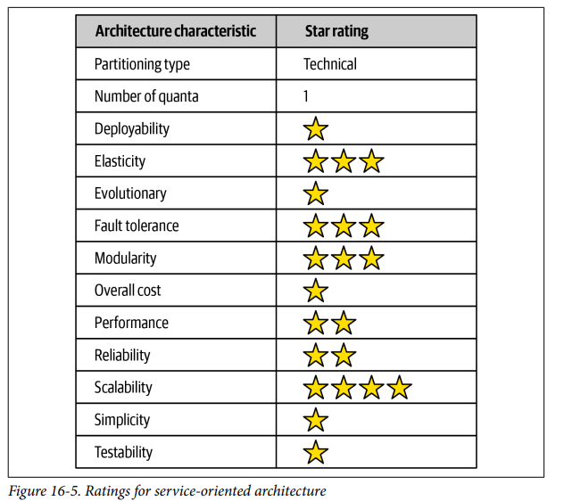

## Architecture Styles Orchestation driven 

### Fecha: 17/09/2024

- **Notas:**
  - Esta arquitectura debe ser entendida bajo el contexto de su era. Las decisiones combinadas con una cultura organizacional desastrosa llevaron esta arch a la irrelevancia. Las companías en los 90's tardios necesitaban IT más sofisticada, se necesitaba escalabilidad y crear distribuidas pero con limitaciones. OS era por máquina y con licencia individual. Reusar era la nueva filosofía. 
  - La topología establece una taxonomía de servicios.
  
  - Muchas companias se molestaban de tener que reescribir software, cada capa de esa topología busca reducir esto y reusar. 
    - Negocio: dan el punto de entrada, no-code solo input/output y schemas, definidos por usuarios de negocio. 
    - Empresa: servicios de grano fino con implementaciones compartidas. Comportamiento átomico, building-block de servicios de grano grueso utilizando el orquestador. La naturaleza dinamica del software desafia esta colección de reusables.
    - Aplicación: No son tan granulares pero son servicios de un solo uso como geolocation, que no merece ser reusable.
    - Infra: Temas operacionales como log, monitor, auth.
    - Orchestation: Es el corazón en esta distribución, se liga a una o unas pocas dbs, maneja el comportamiento transaccional, por ley de Conway el team de integraciones que maneja esto se vuelve un cuello de botella de burocracia. 
  - En la práctica es un desastre, muy complejo construir servicios tan granulares para su reuso, arch se vuelve cada vez más compleja, extramanejos de campos y lógica que no es necesaria por ser compartida y los límites son dificiles de definir, también la naturaleza va en contra de esto. Impractico una arch tan orientada a separación técnica.
  - Demasiado coupling, el reuso implica acoplamiento que hace el cambio más riesgoso, deploys coordinados, test más complejo y menos eficiencia. 
  - Ratings: 
  
  Partición muy técnica, single quantum por el uso de una sola db y mucho coupling entre layers y el engine orch.  
  Técnicas de ingenieria moderna como deploys, tests y evolucionaria no están presentes.  
  Elasticidad y escalabilidad están presentes.  
  Performance no presente una request está muy distribuida.  
  Simplicidad y costo muy malas.  

- **Preguntas:**
  - **1. What was the main driving force behind service-oriented architecture?**  
  

    
Ver respuesta

    Reusar, no tener que reescribir software al hacer piezas tan pequeñas y reusables que puedan armar nuevos servicios.
  

  - **2. What are the four primary service types within a service-oriented architecture?**  
  

    
Ver respuesta

    Negocio, empresa, infra, aplicación.
  

  - **3.  List some of the factors that led to the downfall of service-oriented architecture.**  
  

    
Ver respuesta

    En la práctica es un desastre, muy complejo construir servicios tan granulares para su reuso, arch se vuelve cada vez más compleja, extramanejos de campos y lógica que no es necesaria por ser compartida y los límites son dificiles de definir, también la naturaleza va en contra de esto.
  

  - **4. Is service-oriented architecture technically partitioned or domain partitioned?**  
  

    
Ver respuesta

    Muy técnica.
  

  - **5. How is domain reuse addressed in SOA? How is operational reuse addressed?**  
  

    
Ver respuesta

    Dominio al crear servicios que encapsulan funciones específicas de un dominio de negocio, lo que permite que diferentes partes de la organización reutilicen los mismos servicios sin duplicar lógica.
    Operacional mediante la creación de servicios de infraestructura y aplicación que se pueden reutilizar en múltiples operaciones o flujos.
  

## Recursos Adicionales
- [Course](https://fundamentalsofsoftwarearchitecture.com/)