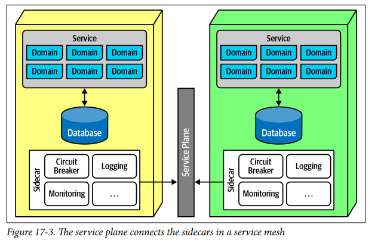
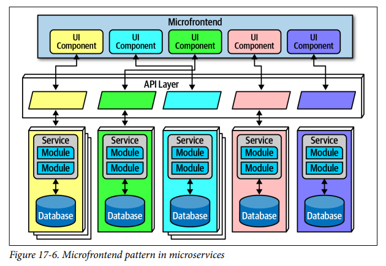
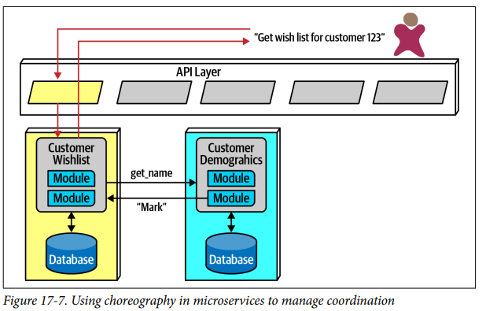
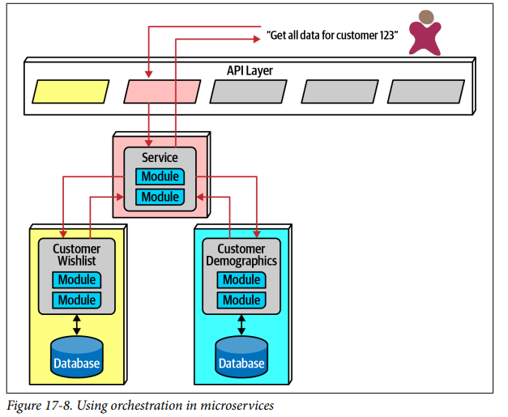
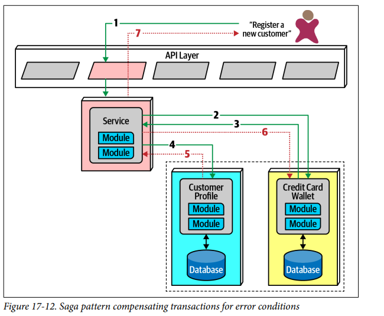
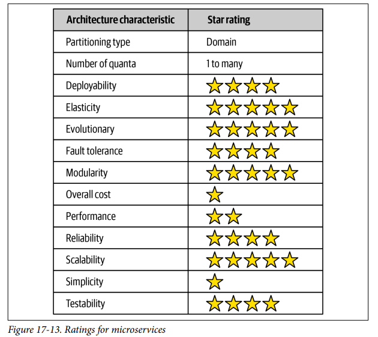

## Architecture Styles Microservices

### Fecha: 17/09/2024

- **Notas:**
  - Muy popular actualmente.
  - A diferencia de otras archs que no son nombradas ni diseñadas por un consenso de arquitectos esta nace de un blog de Martin Fowler en el 2014. 
  - Muy inspirada en el DDD, donde el concepto de bounded context es muy importante. Bounded context representa un estilo de desacoplamiento, cuando un dev define un dominio este tiene muchos artefactos como entidades y comportamientos representados por clases de código, schemas, etc. Un dominio de Catalog tiene conceptos de items, usuarios y pagos, en algo monolitico el dev comparte muchos artefactos, haciendo clases reusables y dbs linked. Dentro de un bounded context, las clases de código y dbs schemas están acopladas para un trabajo pero no para nada por fuera del bounded context (como otro bounded context que necesite esas definiciones). Cada contexto define lo que necesita en lugar de acomodarse a un reuso. Decoupling vs reuso (trade-off), alto decoupling favorece la duplicación, microservices es high high decoupling, modelar la noción de bounded context. 
  - La topología son servicios, API layer, dbs, colas (async communication), cliente(s).
  
  - Debido a su naturaleza single-purpose los servicios son muchos más pequeños que en otras arquitecturas distribuidas, se espera que cada servicio incluya todo lo necesario para operar de manera independiente incluyendo la db. 
  - Distribuida, cada servicio ejecuta su propio proceso, esto gracias al cloud, las VMs y los contenedores que quitaron la imposibilidad de que un dominio tuviese su propia infra, dando más evolucionaridad. El alto nivel de desacoplamiento resuelve la isolation incorrecta en archs de múltiples inquilinos que aunque compartian recursos, ancho de banda, disco, etc limitaba a algunos componentes a crecer por la arquitectura compartida, esto ya no ocurre con los servicios altamente desacoplados. El performance es un aspecto negativo ya que en la naturaleza de distribución la comunicación con protocolos de red es más costosa que el llamado con métodos y la verificación de seguridad distribuida añade tiempo adicional al procesamiento. La distribución también limita el uso de transacciones, es más, no se recomienda su uso y se apunta a que el diseño de granularidades correctas en cada servicio sea la solución.  
  - El bounded context en donde cada servicio modela un dominio o workflow y por tanto incluye todo lo necesario para operar. Con esto se prefiere la duplicación sobre el reuso. Toma el concepto de partición por dominio al extremo, servicio = dominio/subdominio, representación física de un bounded context y de los conceptos de DDD. 
  - La granularidad es con lo que más luchan los arquitectos, es clave encontrar la granularidad correcta ya que un servicio muy pequeño va a requerir comunicación entre servicios para hacer un trabajo. No por ser micro deben ser muy de grano fino pero claro tampoco son macroservices. EL proposito de los límites de los servicios es capturar un dominio o flujo de trabajo, a veces, los limites naturales que establece la lógica de negocio pueden ser más grandes debido a que los procesos estén más acoplados, hay una guía para determinar esos límites: 
    - Proposito: Un dominio, cada micro debe ser extremadamente cohesivo funcionalmente y contribuir en un comportamiento significativo de la aplicación.
    - Transacciones: Las entidades que trabajan en un flujo pueden funcionar para determinar un límite, si podemos diseñar para evitar las transacciones entonces tenemos un mejor diseño de granularidad.
    - Coreografía: Si se construye un conjunto de servicios con muy buena domain isolation pero que requieren mucha comunicación entre ellos para funcionar entonces debería considerar poner esos servicios en un servicio más grande que evite tanta comunicación.
  La iteración es clave para diseñar de manera correcta, a la primera seguramente no sea un buen diseño pero la iteración ágil pule esto.
  - A pesar de que aquí se rompe con la single db que acopla con muchos schemas no debemos ir al extremo de la entity trap, los servicios no debe ser modelados como entidades. Hacer una sola fuente de la verdad en una db no es más una opción, debe entonces ver si un dominio se vuelve la fuente que da los datos con comunicación entre servicios o si usa replicación o caché para distribuir la info. 
  - Cada servicio/dominio puede elegir las herramientas que más le convengan, bases de datos con schema rigida o sin él, etc.
  - La capa de API es opcional y se situa entre consumidores y los servicios. Ofrece la posibilidad de hacer de proxy inverso o facilidades operacionales. No debe ser usada como mediador o herramiento de orquestación si la arquitectura quiere mantenerse a su filosofía, esto rompería los bounded context que deben ser cada servicio. El uso de service descovery en donde la request pasa por esta herramienta para ser redirigida y mientras tanto monitorear el número de instancias y requests para escalar y elasticidar, también es común en esta API.
  - Partes que se benefician del acomplamiento como las operacionales (monitor, logs, auth, circuit breakers), el patrón sidecar ofrece una solución. El componente de sidecar contiene todos esos temas operacionales y está dentro dentro de cada servicio (como componente separado) que puede ser manjeado por un team de infra compartido o por cada quién, cuando se necesitan cambios entonces cada servicio recibe la actualización, cuando ya todos estén entonces se puede hacer un service mesh para unificar el control en donde los compos conectan para formar una interfaz consistente.
  
  - Hay dos estilos para el frontend, uno ligado a la filosofía con microfrontends que genera componentes en la UI para mapear la granularidad e isolation de los microservices del backend. Servicio / UI. La otra y más sencilla y más usada es un front monolitico que usa el API layer para sus requests.
  
  - Comunicación, primero debe encontrarse el mejor tipo de comunicación async o sync, esperar o no la respuesta, micros usan protocol-aware heterogeneous interoperability. 
    - Protocol aware: como no hay un huc centralizado, cada servicio debe conocer (o descubrir) que protocolo usar para llamar a otros servicios, los arch estandarizan la vaina con REST, colas generalmente.
    - Heterogenea: cada servicio puede estar escrito en un stack de tech distinto, heterogenea sugiere que esta arch soporta ambientes poliglotas (diferentes servicios diferentes plataformas).
    - Interoperabilidad: Llamado entre servicios. 
  - Para async se usan eventos y msgs y event-driven arch dentro de los servicios, el patrón de broker y mediator se manifiestan como coreografía y orquestación. Coreografía sin una entidad central y donde los servicios se llaman como necesiten, esto es más simbiotico a la filosofía y al objetivo de los microservicios, se mantiene el alto decoupling pero hay problemas para gestionar muchos o gestionar errores, el primer servicio que se llama debe ser el encargado de gestionar muchos llamados (front controller pattern) en donde se convierte en un mediador muy complejo.
  
  En la orquestación, el arch necesita gestionar y coordinar muchos servicios, creando un mediador intermedio cuya única responsabiliadad es coordinar el llamado de la información de una manera particular. Debe encontrarse la mejor manera de representar esos dominios o flujos de trabajo muy acoplados de manera que se cumpla tanto con el dominio acoplado como con la arch, para procesos muy complejos de coordinación es bueno hacer esto.
  
  - Transacciones, no se recomiendan, si tiene que hacerlas mejor plantee de nuevo la granularidad de los servicios, si hay muchas transacciones es que son servicios de grano muy fino, se está incumpliendo la filosofía, creando connasence de valor (la peor) y fallando en establecer los límites. Para excepciones hay patrones como el saga, en donde un servicio actua como mediador entre múltiples llamados y según los éxitos o fallos coordina el resultado. Si un error occure debe asegurarse que ninguna data en success se actualice, mandando un request de undo a todas las partes de la transacción, esto se llama compensating transaction framework. Esto se vuelve más complejo si hay comunicación async. El hacer que los devs hagan undo operations para cada operación dobla el tiempo de trabajo. Unas pocas trx entre servicios a veces son necesarias, si es la feature dominante de la arch entonces hay errores.
  
  - La arquitectura de microservicios organiza una aplicación en pequeños servicios independientes, donde cada uno se encarga de una tarea específica y se comunica mediante interfaces bien definidas. A diferencia de la arquitectura basada en servicios, donde los servicios suelen ser más grandes y están más interconectados, los microservicios priorizan la independencia, con su propio código, base de datos y entorno de ejecución, lo que permite desplegar y escalar cada uno de manera individual. Aunque los microservicios ofrecen flexibilidad, escalabilidad y agilidad, también introducen una mayor complejidad debido a la necesidad de coordinar múltiples servicios. Por otro lado, la arquitectura basada en servicios es más sencilla de gestionar, pero tiene una mayor dependencia entre los servicios. Por ejemplo, en un sistema de reservas de hotel, la arquitectura de microservicios dividiría funcionalidades como la gestión de habitaciones, reservas, pagos y reseñas en servicios separados e independientes, cada uno con su propia base de datos y recursos. En la arquitectura basada en servicios, estas funcionalidades estarían gestionadas por servicios más integrados y dependientes de un coordinador central, lo que dificulta su actualización de manera independiente. En resumen, los microservicios se centran en la modularidad e independencia, mientras que la arquitectura basada en servicios implica servicios más grandes e interconectados.
  - Ratings: 
  
  Soporta prácticas de ingenieria modernas de muy buena manera, deploy auto y por ms, test, evolución e integración de nuevas cosas como ms, esto debido a la mano y caminos cruzados de microservicios con DevOps.  
  Tolerancia a fallos y fiabilidad se afecta con mucha comunicación entre servicios, pero se manejan con redundancia y escalamiento con service discovery. Single-purpose ms es altamente tolerante a fallos.  
  Escalabilidad y elasticidad muy altas, servicios independientes y escalables e elasticos independientes según necesidad.  
  Perfomance afectado pro extra procesamiento de seguridad y llamados en la red.  
  Muy orientada al dominio, por tanto esa es su partición, el extreme decoupling apunta a múltiples quantas con servicios de diferentes caracteristicas pues son muy independientes y operan con lo que necesitan dentro de ellos.
- **Preguntas:**
  - **1. Why is the bounded context concept so critical for microservices architecture?**  
  

    
Ver respuesta

    El concepto de bounded context es critico porque esta arch busca generar la noción física de este al generar servicios que declaren lo que necesitan en lugar de adapartse al reuso, se premia la duplicidad ya que lo más importante es el alto nivel de desacoplamiento entre bounded contexts.
  

  - **2. What are three ways of determining if you have the right level of granularity in a microservice?**  
  

    
Ver respuesta

    Proposito, que haga algo importante de la aplicación y mapee un dominio/subdominio correctamente, que si se visualiza una transacción entonces estos sirva para redefinir los limites y diseñar de nuevo evitando trx, coreografia pues si se requiere mucha comunicación entre servicios debería pensarse en un rediseño de servicio más grande que evite esta sobre comunicación.
  

  - **3. What functionality might be contained within a sidecar?**  
  

    
Ver respuesta

    Todo lo que saca provecho del acoplamiento, temas operacionales como log, monitor, etc.
  

  - **4.What is the difference between orchestration and choreography? Which does microservices support? Is one communication style easier in microservices?**  
  

    
Ver respuesta

    Coreografía no tiene mediador, orquestación pone un servicio en el medio cuyo proposito es realizar esta comunicación necesaria. Ambos soportados, más sencillo y simbiotico coreo.
  

  - **5. What is a saga in microservices?**  
  

    
Ver respuesta

    Patrón para el manejo de trx entre servicios en donde un mediador hace los llamados y según los éxitos o fallos utiliza undo requests para mantener la integridad de los datos.
  

  - **6. Why are agility, testability, and deployability so well supported in microservices?**  
  

    
Ver respuesta

    Los microservicios son pequeños y modulares, lo que facilita realizar cambios rápidos sin afectar al resto del sistema. Esto promueve la agilidad en el desarrollo. Además, al ser independientes, son fácilmente testeables y desplegables de manera aislada, permitiendo mejoras o correcciones sin necesidad de desplegar el sistema completo.
  

  - **7. What are two reasons performance is usually an issue in microservices?**  
  

    
Ver respuesta

    Procesamiento adicional con validación de seguridad en cada ms y llamados usando la red que son más costosos.
  

  - **8. Is microservices a domain-partitioned architecture or a technically partitioned one?**  
  

    
Ver respuesta

    Muy enfocada a la partición por dominio en cada ms.
  

  - **9. Describe a topology where a microservices ecosystem might be only a single quantum.**  
  

    
Ver respuesta

    Single quanta en ms en donde los micros tengan un orquestador encima o en donde haya necesidad de muchos llamados entre ms para cumplir con un flujo.
  

  - **10. How was domain reuse addressed in microservices? How was operational reuse addressed?**  
  

    
Ver respuesta

    El reuso de dominio en microservicios se maneja mediante la creación de microservicios especializados en contextos de dominio muy específicos. Se evita compartir código entre microservicios para garantizar que cada uno tenga autonomía total. El reuso operacional se aborda mediante patrones como el sidecar, donde aspectos operacionales como la seguridad, el monitoreo o el manejo de configuraciones se manejan de forma consistente, pero externa al propio microservicio.
  

## Recursos Adicionales
- [Course](https://fundamentalsofsoftwarearchitecture.com/)