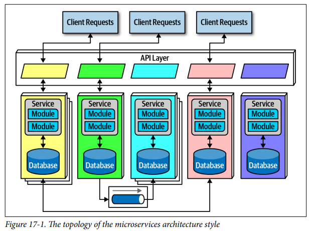
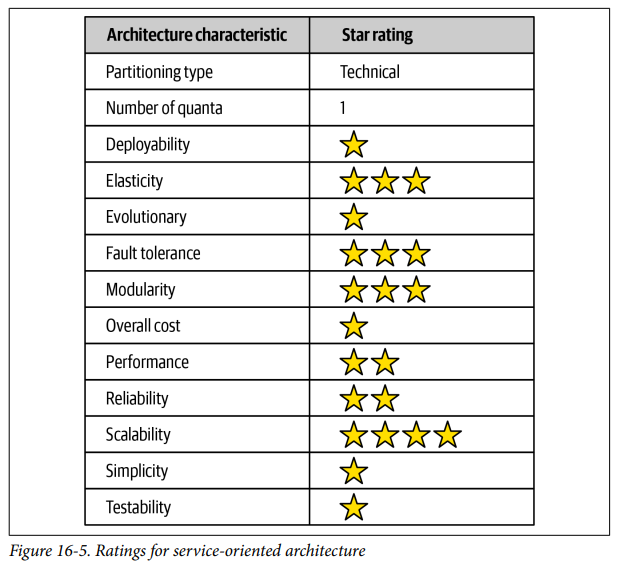

## Architecture Styles Microservices

### Fecha: 17/09/2024

- **Notas:**
  - Muy popular actualmente.
  - A diferencia de otras archs que no son nombradas ni diseñadas por un consenso de arquitectos esta nace de un blog de Martin Fowler en el 2014. 
  - Muy inspirada en el DDD, donde el concepto de bounded context es muy importante. Bounded context representa un estilo de desacoplamiento, cuando un dev define un dominio este tiene muchos artefactos como entidades y comportamientos representados por clases de código, schemas, etc. Un dominio de Catalog tiene conceptos de items, usuarios y pagos, en algo monolitico el dev comparte muchos artefactos, haciendo clases reusables y dbs linked. Dentro de un bounded context, las clases de código y dbs schemas están acopladas para un trabajo pero no para nada por fuera del bounded context (como otro bounded context que necesite esas definiciones). Cada contexto define lo que necesita en lugar de acomodarse a un reuso. Decoupling vs reuso (trade-off), alto decoupling favorece la duplicación, microservices es high high decoupling, modelar la noción de bounded context. 
  - La topología son servicios, API layer, dbs, colas (async communication), cliente(s).
  
  - Ratings: 
  
  Partición muy técnica, single quantum por el uso de una sola db y mucho coupling entre layers y el engine orch.  
  Técnicas de ingenieria moderna como deploys, tests y evolucionaria no están presentes.  
  Elasticidad y escalabilidad están presentes.  
  Performance no presente una request está muy distribuida.  
  Simplicidad y costo muy malas.  
- **Preguntas:**
  - **1. Why is the bounded context concept so critical for microservices architecture?**  
  

    
Ver respuesta

    El concepto de bounded context es critico porque esta arch busca generar la noción física de este al generar servicios que declaren lo que necesitan en lugar de adapartse al reuso, se premia la duplicidad ya que lo más importante es el alto nivel de desacoplamiento entre bounded contexts.
  

  - **2. What are three ways of determining if you have the right level of granularity in a microservice?**  
  

    
Ver respuesta

    Desaparace la base de datos centralizada y las consultas sync a esta. 
  

  - **3. What functionality might be contained within a sidecar?**  
  

    
Ver respuesta

    Messaging grid, data grid, processing grid, deployment manager.
  

  - **4.What is the difference between orchestration and choreography? Which does microservices support? Is one communication style easier in microservices?**  
  

    
Ver respuesta

    Maneja las inputs y las distribuye a las unidades disponibles, puede ser más complejo y conocer el estado de request/unidad.
  

  - **5. What is a saga in microservices?**  
  

    
Ver respuesta

    Escucha del data pump las actualizaciones de data que deben realizarse mediante un contrato de acción definida y realiza estos cambios de manera async.
  

  - **6. Why are agility, testability, and deployability so well supported in microservices?**  
  

    
Ver respuesta

    Caida de todas las unidades asociadas a una cache, redeploy y data archivada que no está en cache.
  

  - **7. What are two reasons performance is usually an issue in microservices?**  
  

    
Ver respuesta

    Incrementa, entre más pequeña más probable.
  

  - **8. Is microservices a domain-partitioned architecture or a technically partitioned one?**  
  

    
Ver respuesta

    tipicamente replicada, in-memory grids en cada unidad replicadas por el data grid, en distributed un server central accedido por las unidades, la decisión se toma según el tamaño y update rate, es performance y tolerancia vs consistencia.
  

  - **9. Describe a topology where a microservices ecosystem might be only a single quantum.**  
  

    
Ver respuesta

    Escalabilidad, elasticidad y performance.
  

  - **10. How was domain reuse addressed in microservices? How was operational reuse addressed?**  
  

    
Ver respuesta

    Es dificil testear los niveles de concurrencia tan extremos, pruebas en caliente en prod. 
  

## Recursos Adicionales
- [Course](https://fundamentalsofsoftwarearchitecture.com/)