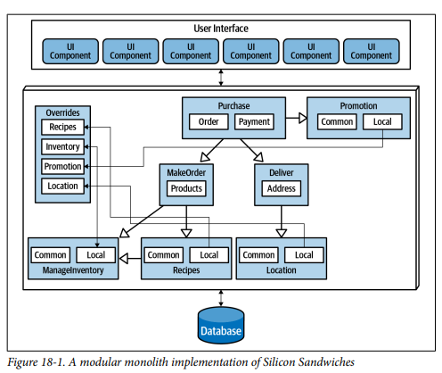
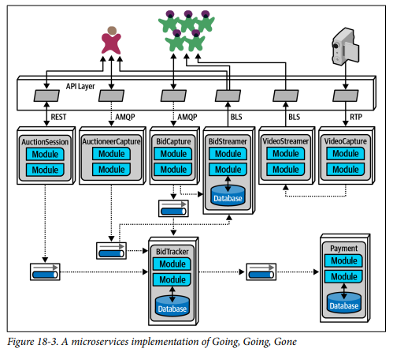

## Architecture Styles Choosing

### Fecha: 25/09/2024

- **Notas:**
  - Depende!
  - La elección cambia a través del tiempo según ciertos factores: 
    - Observaciones del pasado: Arquitectos tienen experiencia de sistemas pasados que influencian su pensamiento, nuevas archs reflejan y cubren deficiencias de estilos pasados.
    - Cambios en el ecosistema: Es caótico, no hay futuras predicciones del cambio. 
    - Nuevas capacidades: El cambio constante entrega nuevas herramientas y capacidades, arquitectos deben echar un ojo no solo a nuevas herramientas sino nuevos paradigmas. Las nuevas capacidades no tienen que cambiar por completo el mundo del desarollo, se pueden alinear con un cambio menor de la arquitectura. 
    - Aceleración: La tasa de cambio también aumenta, nuevas herramientas son nuevas prácticas de ingenieria, diseños y capacidades.
    - Cambios de dominio: Los negocios evolucionan o se fusionan. 
    - Cambios de tech: cambios en el bottom-line son acogidos. 
    - External: costos, cambios en la cultura de la empresa, etc. 
  - Arquitecto debe entender las tendencias de la industria y tomar las decisiones correctas de negocio y cuando tomar excepciones. 
  - Criterio de decisión, dos factores predominan, especificaciones de dominio y los elementos estructurales requeridos para el éxito: 
    - Dominio: Arquitectos deben entender el dominio en especial lo que afecta las caracteristicas operacionales. 
    - Caracteristicas que afectan estructura: Descubrir las ilities necesarias para soportar el dominio y su éxito. 
    - Data architecture: Archs + DBAs deben colaborar en schema, db pues los archs deben entender el impacto que tiene la data en el diseño. 
    - Factores organizacionales: Costos, fusiones, cultura. 
    - Conocimiento operacional: Cómo son los procesos de desarrollo, soportan el estilo?. 
    - Isomorfismo: El dominio puede ser isomorfo a un estilo, customización? microkernel. Así mismo, dominios en contra de estilos, dominio muy acoplado como un sistema de multipage forms con contextos previos es duro de modelar en un high-decoupled como microservicios. 
  - El arch debe tomar determinaciones en: 
    - Distribuido vs mono: Usando el concepto de quantum, un solo set de ilities es suficiente? si es verdadero se puede acomodar al mono, sino ya sabemos que debemos ir a distri.
    - Dónde va la data?: Si es mono se asume una o unas pocas dbs. En distri decidir qué servicios persisten y en en el flujo de la data, estructura y comportamiento. 
    - Estilo comunicación: Sync más conveniente en la mayoría de casos, async con beneficios de performance y scale pero con dolores de cabeza como error, sync, deadlocks, debug, etc. Use sync por defecto y async cuando se necesite. 
  - El output de todo esto es escoger el estilo/topología, ADRs del diseño y fitness functions para proteger las ilities más importantes. 
  - En el caso de silicon sandwich tenemos un single quantum, no mucho presupuesto, el mono surge. Tenemos un diseño modular, 1 db, 1 UI, y domain components, para soportar la customization debemos poner esa feature como parte del dominio (common, local y un endpoint override para subir esas customs). 
  
  Otra idea, considerando el isomorfismo es usar microkernel, core system componentes de dominio + db, cada custom como un plugin, con BFF en donde la API traslada la info al device. Comunicación sync, no requerimos performance o scale tan especial. 
  
  - Para las audit, necesitamos diferentes ilities entonces distri. Necesitamos altos niveles de scale, elasticity, performance, microservices soporta bien esto. 
  
- **Preguntas:**
  - **1. In what way does the data architecture (structure of the logical and physical data models) influence the choice of architecture style?**  
  

    
Ver respuesta

    La arquitectura de datos influye en la elección del estilo de arquitectura porque define cómo se organizan y acceden los datos. Por ejemplo, si los datos están altamente centralizados y normalizados, es más probable que un estilo de arquitectura monolítica sea adecuado. En contraste, si los datos están distribuidos o segmentados por dominios lógicos, una arquitectura de microservicios o basada en bounded contexts sería más apropiada para garantizar el desacoplamiento y la escalabilidad.
  

  - **2.  How does it influence your choice of architecture style to use?**  
  

    
Ver respuesta

    La arquitectura de datos influye en la elección del estilo al dictar cómo los servicios manejan y acceden a los datos. Si la arquitectura de datos permite una clara segmentación, los servicios pueden ser diseñados de manera independiente, facilitando la adopción de microservicios. Si se necesita una comunicación constante entre componentes y los datos están muy interrelacionados, una arquitectura monolítica o de orquestación podría ser más eficiente.
  

  - **3. Delineate the steps an architect uses to determine style of architecture, data partitioning, and communication styles.?**  
  

    
Ver respuesta

    ...
  

  - **4. What factor leads an architect toward a distributed architecture?**  
  

    
Ver respuesta

    El criterio de un solo conjunto de ilities que soporte todo el dominio y su éxito, la necesidad de escalabilidad, alta disponibilidad, y desacoplamiento, cuando los servicios necesitan ser desplegados y gestionados de forma independiente o si se requieren capacidades de resiliencia y tolerancia a fallos, una arquitectura distribuida es más adecuada.
  

## Recursos Adicionales
- [Course](https://fundamentalsofsoftwarearchitecture.com/)