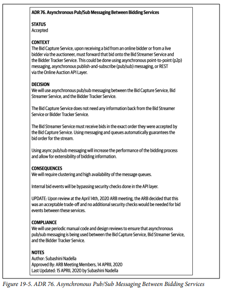

## Architecture Decisions

### Fecha: 26/09/2024

- **Notas:**
  - Una de las responsabilidades del arquitecto es tomar decisiones, usualmente decisiones que involucran la estructura o tecnología cuando esta impacta las ilities. 
  - Una buena decisión es aquella que ayuda a guiar a los devs en tomar las decisiones tecnicas correctas. 
  - Requiere recolectar la suficiente información relevante, justificar la decisión, documentarla y comunicarla de manera efectiva.
  - Muchos antipatrones surgen cuando se toman decisiones, el antipatron es algo que parece buena idea al inicio pero te lleva a problemas o un proceso repetible que genera malos resultados, los patrones que suelen emerger son: 
    - Covering your assets: Sucede cuando un arqui evita tomar una decisióm por miedo a que sea incorrecta. Para sobrepasar esto, puede esperar hasta el último momento de responsabilidad para tomar la decisión, es decir esperar hasta que tenga la suficiente info para justificar pero sin retrasar a los equipos. Otra manera es colaboración continua con los devs para ver que se implementa la decisión como se espera y poder responder al cambio ASAP.
    - Groundhog Day: Nombrado por la pelicula de Bill Murray, ocurre cuando la gente no sabe por qué se tomó una decisión, no hubo justificación acertada que de tanto detalles tecnicos como de negocio (romper un monolito -> mantenibilidad y deploy - mejorar time to market), si algo no da valor al negocio entonces debe ser reconsiderado. Mejorar costo, time to market, user satisfaction y posicionamiento estrategico son buenas razones. 
    - Email-driven: Ocurre cuando la gente no sabe o olvida de una decisión y no puede implementarla. No hubo comunicación efectiva, un email puede ser útil para comunicar pero no para documentar. La regla es no incluir la decisión en el body del email, no permite todos los detalles justificados y ante un cambio o upgrade es complicado. Lo ideal es mencionar el contexto de la decision en el body y un link al sistema de documentación. Otra regla es notificar solo a quien le interesa/impacta. “Hi Sandra, I’ve made an important decision regarding communication between services that directly impacts you. Please see the decision using the following link…”
  - Una decisión debe ser significante para la arquitectura, afectando la estructura, ilities, dependencias, interfaces o técnicas de construcción. Si una decisión de una tech en particular afecta esto entonces es una decisión de arquitectura ya que es significante. La estructura se refiere a los patrones o estilos de la arch, dependencias se refiere a los puntos de acoplamiento entre componentes o servicios en el sistema, interfaces a como los componentes o servicios son accedidos y orquestados, y técnicas de construcción son plataformas, frameworks, herramientas y procesos.
  - Para documentar se usa un ADR (Arch decision record), pequeño archivo de texto (1 o 2 pag) describiendo la decisión. Consiste de titulo, status, contexto, decisión y consecuencias, se sugiere añadir secciones de compliance y notas y puede ser igualmente extendido a lo que se necesite, por ejemplo una sección de alternativas. 
    - Titulo: Numerado secuencialmente y corto “42. Use of Asynchronous Messaging Between Order and Payment Services.”
    - Status: Proposed, Accepted, Superseded. Proposed cuando alguien de más nivel debe aprobar según criterios, Accepted aprobada y lista para implementar, Superseded ha sido cambiada y sobrepasada por otra ADR, tuvo que ser Accepted antes, ayuda a mantener un record de las decisiones y el por qué del cambio, así propuestas pueden descartarse si ya se hicieron y fueron sobrepasadas, se ve así ADR 42. Use of Asynchronous Messaging Between Order and Payment Services Status: Superseded by 68 ADR 68. Use of REST Between Order and Payment Services Status: Accepted, supersedes 42. Un estado que puede existir es el RFC (Request for comments) en donde se pone un deadline. El criterio de aceptación debe ser establecido entre arqui y superior, criterios de costo, cross-team impact y seguridad para que deba ser algo que necesite aprobación. 
    - Contexto: Qué situación fuerza la toma de esta decisión? describir la situación y enunciar brevemente las alternativas, describiendo el contexto se describe la arch. “The order service must pass information to the payment service to pay for an order currently being placed. This could be done using REST or asynchronous messaging.”
    - Decision: Decisión y justificación detallada, afirmativa y con voz comandante, más enfásis en por qué que en el cómo. “we will use asynchronous messaging between services.”
    - Consecuencias: Documentan el impacto, tanto bueno como malo, poner en trade-off la decisión, usar async por ejemplo que tiene el trade-off perfomance con manejo de errores complejo, se dió una discusión con negocio de qué es más prioridad y se documenta ese trade-off ahí. 
    - Compliance: Fuerza a pensar en cómo se va a governar, manual o automatico con una fitness function. Puede especificarse la función o la manualidad. 
    - Notas: Metadata. Original author. Approval date. Approved by. Superseded date. Last modified date. Modified by. Last modification. 
  - El guardado, puede ser en Git, con el código, para oragnizaciones grandes se vuelve complicado por el acceso al repo y por el contexto, una integración en donde va?. Mejor usar una wiki o un directorio comaprtido de archivos con una estructura ADR -> Application -> Common, App1, App2, Integration, Enterprise. Application para decisiones del contexto de la aplicación, common para las que aplican a todo y luego directorio por aplicación. Enterprise para globales. 
  
- **Preguntas:**
  - **1. What is the covering your assets anti-pattern?**  
  

    
Ver respuesta

    Antipatron que ocurre cuando un arquitecto no toma la decisión por miedo a que sea incorrecta.
  

  - **2.  What are some techniques for avoiding the email-driven architecture antipattern?**  
  

    
Ver respuesta

    No use el email como documentación, solo para comunicar con descripción de la decisión + link a la documentación y solo a las personas que les impacta/interesa.
  

  - **3. What are the five factors Michael Nygard defines for identifying something as architecturally significant?**  
  

    
Ver respuesta

    Estructura, ilities, dependencias, interfaces, técnicas de construcción.
  

  - **4. What are the five basic sections of an architecture decision record?**  
  

    
Ver respuesta

    Titulo, status, contexto, decisión, consecuencias.
  

  - **5. In which section of an ADR do you typically add the justification for an architecture decision?**  
  

    
Ver respuesta

    En la decisión.
  

  - **6. Assuming you don’t need a separate Alternatives section, in which section of an ADR would you list the alternatives to your proposed solution?**  
  

    
Ver respuesta

    En el contexto con una breve mención.
  

  - **7. What are three basic criteria in which you would mark the status of an ADR as Proposed?**  
  

    
Ver respuesta

    Debe ser aprobada por alguien superior ya sea por costo, impacto en otros equipos o seguridad.
  

## Recursos Adicionales
- [Course](https://fundamentalsofsoftwarearchitecture.com/)