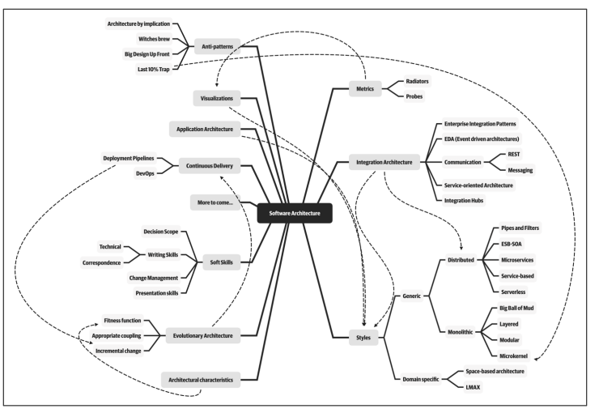
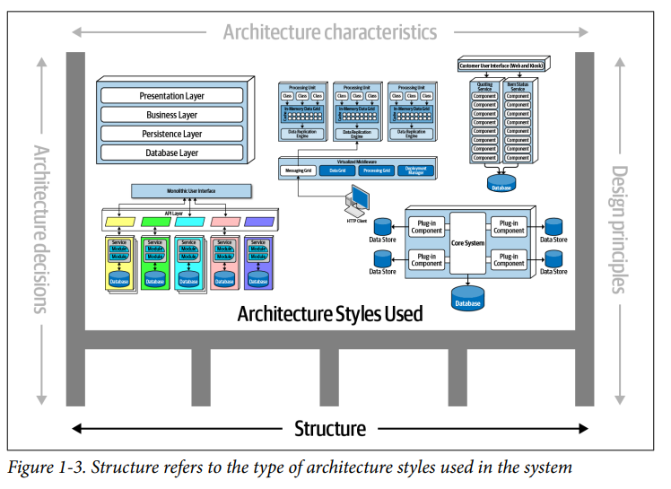
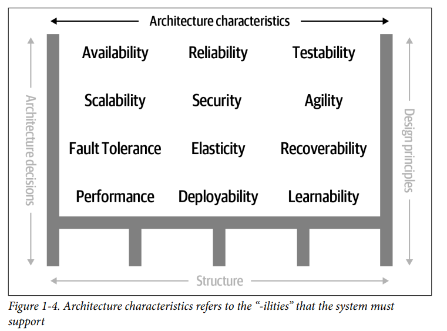
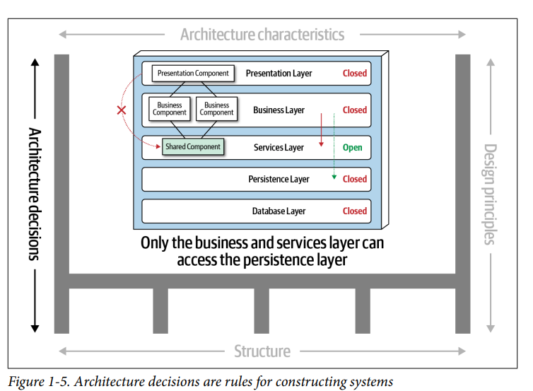
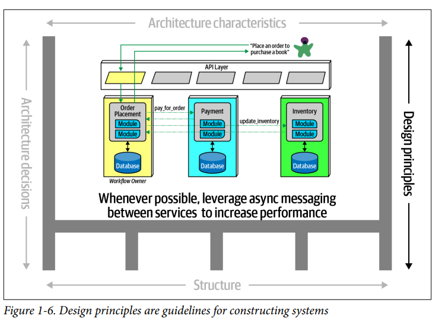

## Introducción

### Fecha: 20/08/2024

- **Notas:**
  - La industria no tiene una buena definición de arquitectura de software. 
  - El alcance de esto es muy grande, se ha expandido de estilos, metricas, soft skills, devops, entre otros. 
  
  - Cualquier definición va a ser obsoleta en unos años, se mueve rápido como el sector. 
  - Todas las arquitecturas son producto del contexto, no se puede imaginar microservicios hace 20 años. 
  - Podemos describir la arquitectura de software como la estructura + caracteristicas + decisiones + principios de diseño. La estructura refiere al estilo arquitectonico (micros, layer, etc). Las caracteristicas o las -ilities son aquellas que definen el éxito del sistema y sus funcionalidades (Disponibilidad, seguridad, etc). Las decisiones son reglas de cómo se debe construir el sistema (Conexiones a bases de datos desde el back) y por último, el principio de diseño es una guía más que una regla de como debe construirse el sistema. 
  
  
  
  
  
  - Las expectativas de un arquitecto son estas 8 cosas: 
    - Tomar decisiones de arquitectura. 
    - Analizar continuamente la arquitectura. 
    - Mantenerse al día con las tendencias. 
    - Asegurar conformidad con las decisiones tomadas. 
    - Diversificar la exposición y experiencia en tech. 
    - Tener conocimientos del negocio.
    - Tener skills interpersonales. 
    - Entender y manejar politicas. 
  - Se espera que el arquitecto defina las decisiones de arquitectura para guiar las decisiones tech en el equipo. El arquitecto debe guiar en lugar de especificar, usen este tipo de frameworks, no este en especial. La decision de arquitectura no debe tomar la decision tech, debe guiarla. 
  - La vitalidad de la arquitectura depende de que el arquitecto esté continuamente analizando la arquitectura y ambiente tech actual para recomendar mejoras. 
  - Asegurar conformidad se refiere a verificar que el equipo de desarrollo esté siguiendo las decisiones arch y los principios de diseño. 
  - Diversificar la exposición y experiencia con multiples tecnologías, frameworks, plataformas. 
  - Debe entender y manejar las politicas pues cada decisión de arch va a ser cuestionada y debe ser negociada. 
  - La arquitectura se está cruzando ahora con las prácticas de ingenieria, devops, procesos y data. 
  Las prácticas son aquellas agnosticas al proceso que dan beneficios al aplicar, CI/CD por ejemplo. Los arquitectos representan en ocasiones el rol de lider técnico, y debe alinear ña arquitectura excogida con las prácticas, una arquitectura agil requiere prácticas agiles para formar una arquitectura evolucionaria, monitoreable de sus caracteristicas. 
  - El proceso hace referencia a cómo se forman los equipos y como se manejan, la manera como construyes afecta la arquitectura. Arquitectos en Agile cuentan entonces con más feedback por un loop de proceso más rápido y eso les permite ser más agresivos con su arquitectura. 
  - Las leyes de la arquitectura de software: 
    - Todo en arquitectura de software es un trade-off (pros/cons). 
    - Si el arquitecto encuentra algo que no es un trade-off, no lo ha identificado entonces. 
    - Por qué es más importante que cómo. 

- **Preguntas:**
  - **1. What are the four dimensions that define software architecture?**  
  

    
Ver respuesta

    Estructura, características, decisiones y principios de diseño.
  

  - **2. What is the difference between an architecture decision and a design principle?**  
  

    
Ver respuesta

    La decisión es una ley concreta y aplicada de inmediato sobre la arquitectura, solo analizada en trade off y casos muy especiales, mientras que el principio de diseño funciona como una guía más general.
  

  - **3. List the eight core expectations of a software architect.**  
  

    
Ver respuesta

    - Tomar decisiones de arquitectura.  
    - Analizar continuamente la arquitectura.  
    - Mantenerse al día con las tendencias.  
    - Asegurar conformidad con las decisiones tomadas.  
    - Diversificar la exposición y experiencia en tech.  
    - Tener conocimientos del negocio.  
    - Tener habilidades interpersonales.  
    - Entender y manejar políticas.
  

  - **4. What is the First Law of Software Architecture?**  
  

    
Ver respuesta

    Todo es un trade/off en arquitectura de software.
  

## Recursos Adicionales
- [Course](https://fundamentalsofsoftwarearchitecture.com/)