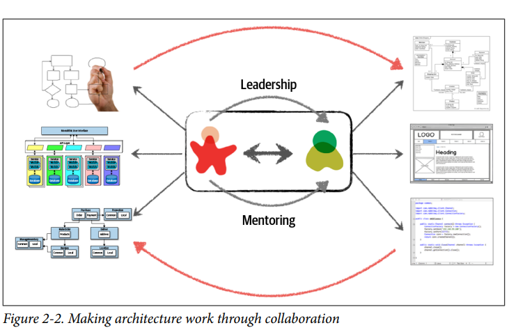
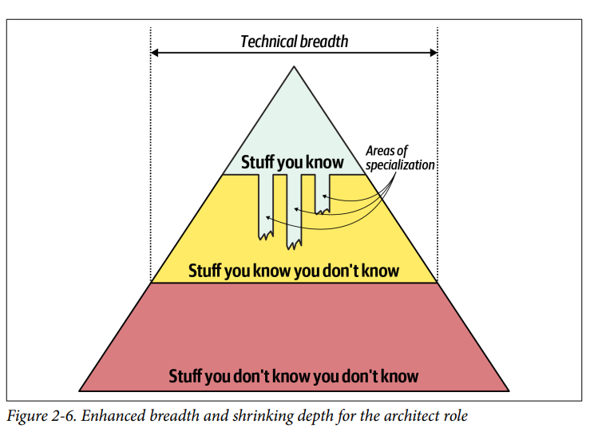

## Architectural Thinking

### Fecha: 20/08/2024

- **Notas:**
  - Lo primero es entender la diferencia entre arquitectura y diseño, creemos erradamente que las responsabilidades del diseño o desarrollo están en las clases, UI, code en general y el arquitecto tiene una línea divisoria pensando en estilo, estructura, caracteristicas pero debemos pensar la arquitectura como algo más global y comunicativo y el diseño mucho más detallado pero el arquitecto es parte de ambos ciclos y da liderazgo al desarrollador en cargo del código. 
  
  - La amplitud técnica es más que la profundidad técnica, en las cosas que sabes son cosas que debes mantener y en donde se da la profundidad técnica. El arquitecto debe ir más allá, a las cosas que conoce peor no sabe y agrandar su amplitud, para conocer más posibles soluciones a un problema. 
  No se debe quemar intentando ser experto en varias áreas.
  
  - El antipatrón frozen caverman sucede cuando un arquitecto por una experiencia pasada tiene siempre la astilla y la incluye en todo lo que desarrolla, debemos ser conscientes del riesgo sí pero también de su probabilidad y realidad. 
  - Todo es un trade-off, en el ejemplo tenemos usar una cola pub sub o varias colas a distintos ms, al parecer la pub sub es más escalable y es la primera opción, pero debemos analizar el trade off, pros extensibilidad y decoupling, cons data access security, no hay contratos de respuesta personalizados, no hay un monitoreo personalizado. Ya luego de esto se analiza y se toma la decisión, pero debe hacerse el pros cons para la decisión que se tome. 
  - Es importante entender el negocio, qué requerimientos son necesarios y cómo transformalos en caracteristicas. 
  - Debe analizar el balance entre arquitecto y desarrollador, evite el cuello botella cuando el arquitecto tiene mucho control sobre el código y detiene al equipo. Reparta las funcionalidades en el equipo y el arch concentrado en una pieza de funcionalidad. Hay 4 maneras de seguir codeando: 
    - Haga POC's. 
    - Ataque la deuda técnica. 
    - Tome algo de las nuevas features.
    - Ataque bugs. 
    - Automatice procesos. 

- **Preguntas:**
  - **1. Describe the traditional approach of architecture versus development and explain why that approach no longer works.**  
  

    
Ver respuesta

    No funciona pensar en una línea divisora entre código y arquitectura (estilos, caracteristicas). No hay una retroalimentación de las decisiones tomadas entre roles.
  

  - **2. List the three levels of knowledge in the knowledge triangle and provide an example of each.**  
  

    
Ver respuesta

    Cosas que conoces -> Redis 
    Cosas que conoces que no conoces -> Cassandra
    Cosas que no conoces -> Nueva DB experimental clave valor
  

  - **3. Why is it more important for an architect to focus on technical breadth rather than technical depth?**  
  

    
Ver respuesta

    Mejor conocer varias posibles soluciones a un problema, sin conocer exactamente como implementarlas a detalle que conocer solo una solución a detalle. Más posibilidad de hacer trade/offs y tomar mejor decisión según el caso.
  

  - **4. What are some of the ways of maintaining your technical depth and remaining hands-on as an architect?**  
  

    
Ver respuesta

    - Haga POC's. 
    - Ataque la deuda técnica. 
    - Tome algo de las nuevas features.
    - Ataque bugs. 
    - Automatice procesos. 
  

## Recursos Adicionales
- [Course](https://fundamentalsofsoftwarearchitecture.com/)