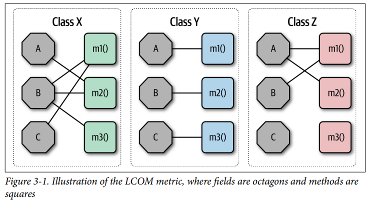
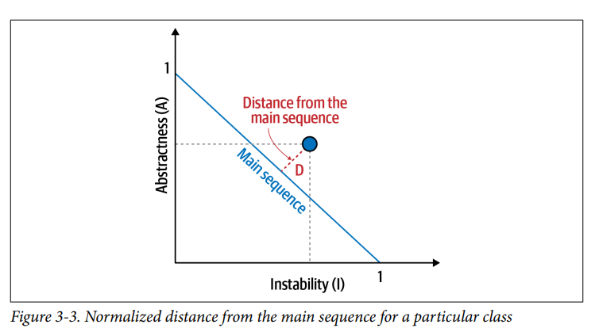
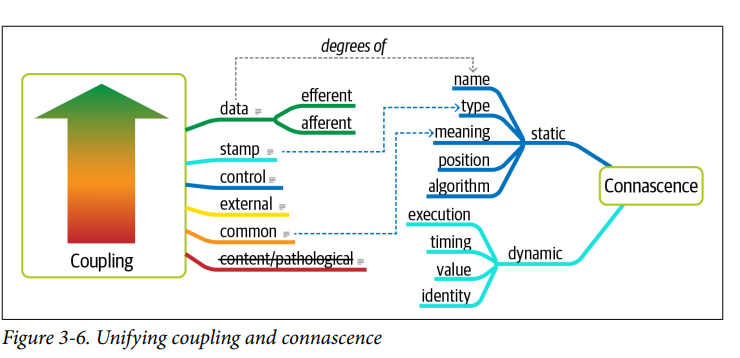

## Modularity

### Fecha: 20/08/2024

- **Notas:**
  - La modularidad es un principio de organización. Preservar buena modularidad es una caracteristica arch implicita. 
  - Modularidad es la agrupación lógica de código relacionado. 
  - Los arquitectos deben estar pendintes porque si los desarrolladores modularizan mal, la reutilización se complica. 
  - Para medir la modularidad tenemos la cohesion, acoplamiento y connascence. 
  - La cohesion refiere a que tan relacionadas están las partes en un módulo. Funcional, sequencial, comunicacional, procedural, temporal, lóguca, coincidencial.  
  - El LCOM mide la cohesion de un módulo, es la suma del conjunto de métodos no compartidos. Un LCOM alto indica carencia de cohesion. La deficiencia de esta métrica es que no determina lógicamente si las partes deben estar unidas. 
  
  - El acoplamiento afferent y efferent mide con grafos las conexiones incoming y outgoing de un artefacto de código a otras. Abstractness es la tasa de artefactos abstractos sobre implementaciones. Inestabilidad es la tasa de efferent sobre efferent y afferent, un código se rompe más con este valor alto por la delegación a otros artefactos.
  - La distancia de la secuencia main se define como la suma de las tasas anteriores - 1, se modela una linea de 1 a 1 X = Inestabilidad y Y = Abstractness, entre más cerca esté a la linea es más balanceada la clase.  Hacia arriba es la zona de lo muy abstracto y dificil de usar por tanto inutil y hacia abajo la zona del dolor, código dificil de mantener. 
  
  - Connascence es un término utilizado en arquitectura de software y desarrollo para describir la interdependencia o acoplamiento entre diferentes partes de un sistema. Este concepto fue introducido por Meilir Page-Jones y es útil para analizar y medir cómo las diferentes partes de un sistema están relacionadas entre sí.
  Connascence describe cómo cambios en una parte del sistema pueden afectar a otras partes. Si dos elementos tienen una alta connascence, significa que están fuertemente acoplados, y un cambio en uno probablemente requiera un cambio en el otro. La connascence puede ser un indicador de la complejidad y el riesgo de mantenimiento en un sistema.
  Existen diferentes tipos de connascence, que se clasifican en dos grandes categorías: estática y dinámica. La connascence estática se refiere a las relaciones que se pueden evaluar en tiempo de compilación o diseño, mientras que la dinámica se refiere a las relaciones que se manifiestan en tiempo de ejecución.
  El objetivo de los desarrolladores es reducir la connascence en las partes del sistema que son propensas a cambiar o que son más críticas, y preferir formas más débiles de connascence, ya que son más fáciles de mantener y refactorizar.
  - Connascence es afferent y efferent coupling pero pasado por programación orientada a objetos. La static es la code-level (Nombre, tipo, meaning, position, algorithm) y la dinamica es en ejecución (ejecución, timing, values, identity). Las propiedades son la fuerza, que es el nivel de dificultad para refactorizar, la localidad de qué tan próximos son los modulos en el code. El grado, o el tamaño de su impacto en número de clases.  
  

- **Preguntas:**
  - **1. What is meant by the term connascence?**  
  

    
Ver respuesta

    Connascence es un término que describe la interdependencia o acoplamiento entre diferentes partes de un sistema. Mide cómo cambios en un componente pueden afectar a otros, evaluando el nivel de acoplamiento y el impacto en la mantenibilidad del sistema.
  

  - **2. What is the difference between static and dynamic connascence?**  
  

    
Ver respuesta

    La static está en nivel de código, la dynamic en nivel de runtime o ejecución.
  

  - **3. What does connascence of type mean? Is it static or dynamic connascence?**  
  

    
Ver respuesta

    Es static. La connascence de tipo (Connascence of Type) se refiere a cuando diferentes componentes de un sistema dependen de los mismos tipos de datos
  

  - **4. What is the strongest form of connascence?**  
  

    
Ver respuesta

    Identidad, cuando dos componentes están tan ligados que un cambio en uno implica de una un cambio en el otro.
  

  - **5. What is the weakest form of connascence?**  
  

    
Ver respuesta

    Nombre. Componentes comparten nombre de variable o método.
  

  - **6. Which is preferred within a code base—static or dynamic connascence?**  
  

    
Ver respuesta

    Es más sencilla de refactorizar una static, hay más claridad. 
  

## Recursos Adicionales
- [Course](https://fundamentalsofsoftwarearchitecture.com/)