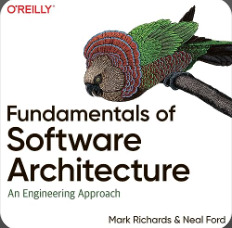

## Architecture Characteristics 

### Fecha: 20/08/2024

- **Notas:**
  - Una solución de software es requerimientos de dominio o funcionales y las caracteristicas de la arquitectura. 
  - Es clave definir, descubrir y analizar las caracteristicas no relacionadas al dominio para el éxito de una arquitectura.
  
  - Una caracteristica debe: 
    - Especificar una consideración no relacionada al dominio. 
    - Influenciar un aspecto estructural de la arquitectura. 
    - Ser importante para el éxito.
  - Especifican criterios de operación y diseño para el éxito. 
  - Debe preguntarse si una caracteristica requiere estructura especial para darse. 
  - Debe ser importante, debemos escoger la menor cantidad de estas de acuerdo a lo necesario. 
  - Implicitas son las que no están en los requermientos y deben ser procesadas por el arquitecto y su conocimiento del dominio.
  - Explicitas si están en los requerimientos.
  - Cada organización define su lista de caracteristicas, se agrupan en categorías amplias. Es imposible encontrar una lista definitiva o definiciones completamente verdaderas, se van a solapar definiciones según el problema.
  - La categoría de las operacionales tiene el performance, elasticidad, resiliencia, las que se cruzan con operacional o devops.
  
  - Las estructurales van de la mano del código, mantenibilidad, extensibilidad.
  
  - Hay un grupo que no entra en categorías como seguridad, disponibilidad y que son cross en muchos aspectos.
  
  - Las arquitecturas pueden soportar solo algunas, no todas porque las soluciones de unas cosas empeoran otras como la seguridad y el rendimiento. 
  - Debe hacerse un trade-off según el problema de dominio y hacer una arquitectura iterativa y evolucionaria que pueda ser modificada con una iteración ágil.

- **Preguntas:**
  - **1. What three criteria must an attribute meet to be considered an architecture characteristic?**  
  

    
Ver respuesta

    Debe ser importante para el éxito de la solución. Debe influir en un aspecto estructural de la arquitectura. Especificar algo no relacionado al dominio.
  

  - **2. What is the difference between an implicit characteristic and an explicit one?**  
  

    
Ver respuesta

    Las caracteristicas explicitas se encuentran en los requerimientos mencionadas. Las implicitas no están mencionadas y es deber del arquitecto según su experiencia y conocimiento del dominio intuir su necesidad.
  

  - **3. Provide an example of an operational characteristic**  
  

    
Ver respuesta

    Escalabilidad, capacidad de operar y responder según el número de usuarios aumenta.
  

  - **4. Provide an example of a structural characteristic.**  
  

    
Ver respuesta

    Extensibilidad, capacidad del sistema de recibir y acoplarse a nuevos plug-ins (funcionalidades extras).
  

  - **5. Provide an example of a cross-cutting characteristic.**  
  

    
Ver respuesta

    Seguridad, presente desde la base de datos hasta la UI de usuario.
  

  - **6. Which architecture characteristic is more important to strive for—availability or performance?**  
  

    
Ver respuesta

    Depende del contexto del sistema, un sistema de procesamiento alto en picos puede preferir el performance para su buen comportamiento durante los picos (análisis). Otro sistema puede requerir disponibilidad 24/7 sin importar pequeños delays (finanzas). 
  

## Recursos Adicionales
- [Course](https://fundamentalsofsoftwarearchitecture.com/)