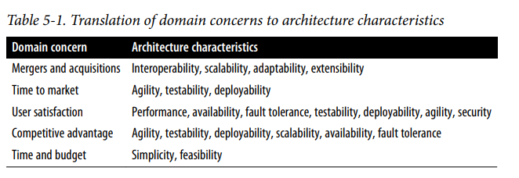

## Identify Architecture Characteristics 

### Fecha: 21/08/2024

- **Notas:**
  - Se requiere no solo entender el problema de dominio sino ta,bién colaborar con los stakeholders para determinar lo realmente importante. 
  - Existen al menos 3 maneras de extraer e identificar caracteristicas: 
    - Del problema de dominio. 
    - De los requerimientos. 
    - Del conocimiento implicito de dominio.
  - Debemos esforzarnos por mantener la lista de caracteristicas cortas, el anti patrón de la generic architecture es cuando hacemos una arch que soporte todas las caracteristicas. Mantener la simpleza es primordial. 
  - En los problemas de dominio muchas veces se quiere generar una lista final de caracteristicas pero este enfoque puede generar mucho desacuerdo y frustración con los stakeholders. Es mejor hacer que ellos seleccionen un top tres de la lista final. También es importante traducirles en lo que se traducen esas caracteristicas para que ellos entiendan la importancia de la disponibilidad, confiabilidad, etc. 
  
  En esas traducciones es importante entender que una sola caracteristica no se traduce, es la combinación de estas según sea el caso. El time to market o tiempo de comercialización no es solo agilidad sino que el deploy y el testeo también son claves.
  - En los requerimientos algunas caracteristicas vienen de manera explicita en ellos, por ejemplo número esperado de usuarios y escalado pero a aveces del conocimiento de dominio, un sistema de registro universitario sabe que debe soportar muchas peticiones en los últimos plazos de tiempo por ejemplo.
  - Los architecture Katas son un método para practicar la identificación de caracteristicas a partir de descripciones del dominio. Tiene sección de descripción, usuarios, requerimientos y contexto adicional.
  - Silicon Sandwiches:  
  Descripción: Tienda nacional de sanduches quiere habilitar ordenes online.  
  Usuarios: Miles de pronto un día millones.  
  Requerimientos/Contexto: Ver a detalle en el libro. Integración de servicios maps. Local daily promotions. Expansión a otros países. Pagos online.  
  Primero separa las caracteristicas en explicitas e implicitas.   
  Explicitas: Número de usuarios -> Escalabilidad para manejar números garndes de usuarios de manera concurrente sin degradar el performance. Elasticidad para manejar rafagas de usuarios. Son dos cosas distintas y podemos tener sistemas escalables pero no élasticos como un reservation hotel. Comúnmente se necesita escalabilidad en sistemas élasticos.  
  Integración externa: Confiabilidad, qué ocurre si el sistema tercero maps está caído? Ofrecer la información limitada por ejemplo.  
  Local daily promotions -> Customización.  
  Pagos online -> Seguridad.  
  Expansión -> Internacionalización.   
  General -> Performance, compras rápidas.   
  Muchas veces es importante definir el tipo de performance y además sacar una medida de performance con escalabilidad por ejemplo, para comparar por número de usuarios.  
  Implicitas: Disponibilidad, los usuarios deben poder acceder al sitio. 
  - Muy importante, la caracteristica realmente es caracteristica si cae en un aspecto estructural y no solo en diseño, si los pagos son con externos entonces solo medidas de seguridad en el código y no tenemos influencia en la estructura. O la customización, un estilo (estructura) para esto como microkernel o desde códidgo y patrones de diseño se puede manejar? Por eso es importante tomar la decisión con el equipo y analizar el trade/off de ambas posibilidades.
  - Una buena práctica es después de la lista intentar eliminar una caracteristica, por ejemplo en este caso manejando la customización desde el código (diseño).
- **Preguntas:**
  - **1. Give a reason why it is a good practice to limit the number of characteristics (“-ilities”) an architecture should support.**  
  

    
Ver respuesta

    No caer en el antipatrón de la arquitectura generica, muchas veces las caracteristicas se impactan entre ellas y manejar muchas genera un sistema muy complejo.
  

  - **2. True or false: most architecture characteristics come from business requirements and user stories.**  
  

    
Ver respuesta

    Puede depender del caso y la especificación de los requerimientos, pero la mayoría vienen del conocimiento de dominio implicito del arquitecto.
  

  - **3. If a business stakeholder states that time-to-market (i.e., getting new features and bug fixes pushed out to users as fast as possible) is the most important business concern, which architecture characteristics would the architecture need to support?**  
  

    
Ver respuesta

    Agilidad, testiabilidad, modularidad y deployabilidad. 
  

  - **4. What is the difference between scalability and elasticity?**  
  

    
Ver respuesta

    Escalabilidad es la habilidad de manejar números grandes de usuarios de manera concurrente sin afectar rendimiento y la elasticidad la habilidad de manejar ráfagas de usuarios. Escalabilidad se refiere a la capacidad de un sistema de crecer para manejar una mayor carga, mientras que elasticidad se refiere a la capacidad de un sistema de adaptarse dinámicamente a cambios en la carga, tanto aumentos como disminuciones.
  

  - **5. You find out that your company is about to undergo several major acquisitions to significantly increase its customer base. Which architectural characteristics should you be worried about?**  
  

    
Ver respuesta

    Escalabilidad para manejar este aumento de usuarios, también pensariamos en elasticidad probablemente. Fiabilidad, disponibilidad y performance tambén serían importantes.
  

## Recursos Adicionales
- [Course](https://fundamentalsofsoftwarearchitecture.com/)