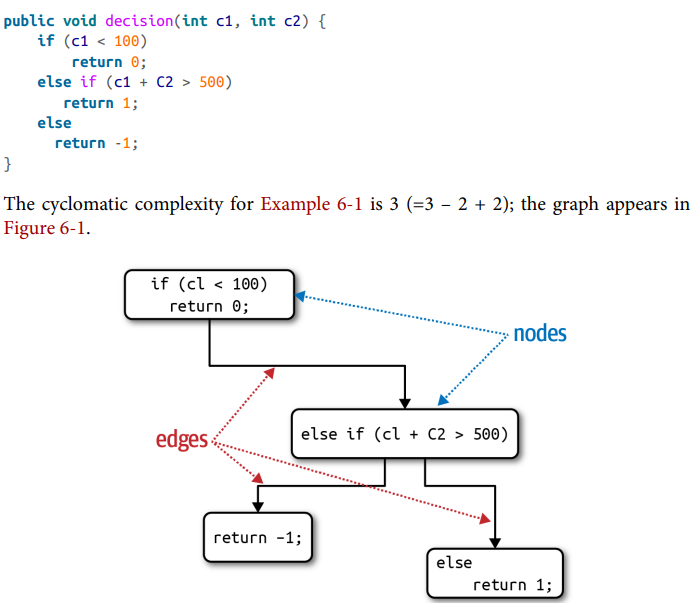
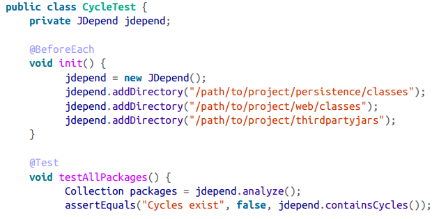

## Governing Architecture Characteristics 

### Fecha: 21/08/2024

- **Notas:**
  - Medir caracteristicas puede ser un problema, porque no son físicas, tienen definiciones muy variadas y son muy compuestas, unas tienen pequeñas partes de otras. Es importante atacar esto desde definiciones objetivas creando un lenguaje ubicuo alrededor de la arquitectura que todos entiendan. 
  - Las caracteristicas operacionales tienen medidas directas pero ofrenecen interpretaciones matizadas según los objetivos del equipo. El performance por ejemplo tiene muchos sabores, el general que es el tiempo de request/response cycle en una aplicación, pero últimamente se ha trabajado en performance budgets, medidas aceptables o presupuestos especificos para ciertas partes de la aplicación como por ejemplo el renderizado del home que atrae más usuarios. O el desarrollo de K-weight budgets que determinan el número máx de bytes descargados en una página en particular.
  - No solo es necesario establecer estos budgests para las medidas operacionales sino también hacer modelos de predicción estadisticos para alarmar sobre sobrepasos a las predicciones de datos anteriores.
  - Para las caracteristicas estructurales lamentablemente no existen metricas intensivas para la calidad interna del código, pero si medidas como la complejidad del código. La Cyclomatic complexity o CC se calcula a una función o método como CC = E - N + 2 siendo N nodos o líneas de código y E edges o posibles decisiones. 
  
  Una buena medida de CC es menor de 10 o incluso menor de 5, preguntandose si es así de complejo el problema o solo está terriblemente mal particionado el código. Crap4J es una herramienta para ver esto.
  - Para medidas de proceso, como la agilidad o testeabilidad o deployabilidad podemos usar herramientas de coverage de test, porcentajes de deploy fallidos, tiempos de deploy, etc.
  - Podemos gobernar estas caracteristicas utilizando funciones fitness, que son cualquier mecanismo que entregue una evaluación de integridad objetiva de una o más caracteristicas. Es una nueva perspectiva de muchas herramientas que ya existen. Dan el mecanismo para proteger automaticamente una caracteristica.
  - Las dependencias ciclicas entre clases afectan la modularidad y general el antipatron de big ball of mud, la solución es una función fitness que busque estas dependencias y ligarla al proceso de CI/CD para no permitir ingreso de código que no lo cumpla.
  
  - El arquitecto debe asegurarse de que el equipo entienda el porqué de una fitness function antes de implementarla.
- **Preguntas:**
  - **1. Why is cyclomatic complexity such an important metric to analyze for architecture?**  
  

    
Ver respuesta

    El CC es importante ya que evalua la calidad del código y su complejidad, influyendo en aspectos como mantenibilidad y modularidad.
  

  - **2. What is an architecture fitness function? How can they be used to analyze an architecture?**  
  

    
Ver respuesta

    Mecanismo que entregue una evaluación de integridad objetiva sobre un conjunto de caracteristicas. Se puede usar para determinar si se cumple o no el objetivo o medida propuesta sobre las caracteristicas y protegerlas de manera automatica ante el constante ciclo de cambio del sistema.
  

  - **3. Provide an example of an architecture fitness function to measure the scalability of an architecture.**  
  

    
Ver respuesta

    Un test en JMeter que realice peticiones de manera creciente (más usuarios concurrentes) al sistema y evalue el performance de estas peticiones de acuerdo a una medida objetivo de performance.
  

  - **4. What is the most important criteria for an architecture characteristic to allow architects and developers to create fitness functions?**  
  

    
Ver respuesta

    Entender porqué se debe cumplir el objetivo para cierta caracteristica, determinar una medida cuantificable de la caracteristica, entender que la caracteristica es importante para el éxito del sistema y protegerla con una función fitness d>e manera automatica.
  

## Recursos Adicionales
- [Course](https://fundamentalsofsoftwarearchitecture.com/)