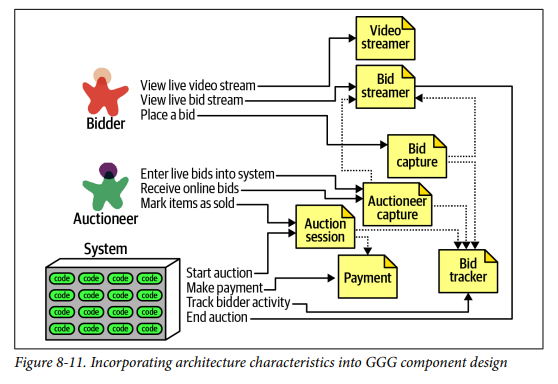

## Component Based Thinking 

### Fecha: 22/08/2024

- **Notas:**
  - Los arquitectos piensan a nivel de componentes, la representación física de un módulo. (Jar files en Java por ejemplo)
  - Los componentes ofrecen un mecanismo de lenguaje especifico para agrupar artefactos juntos, combinandolos y creando estratificación. El más simple es agrupar código a más nivel que de clases y armar una librería. También son componentes los subsistemas o las capas, las unidades deployables o los servicios que pueden tener mucho o poco código y por tanto tener subcomponentes. 
  - Una decisión principal de las primeras que hace un arquitecto es el top-level partitioning de los componentes. El arquitecto debe definir, refinar, manejar y gobernar los componentes. Generalmente es la pieza más pequeña para interactuar en arquitectura, a excepción de metricas de calidad de código. 
  - El top-level partitioning tiene luego por dentro más componentes, pero me ayuda a definir el estilo y la manera de partir el código. Partición técnica cuando nos basamos en las capacidades técnicas, presentar, dominios o reglas de negocio, persistir, etc. El patrón de diseño MVC es un ejemplo de esto o la arquitectura layered. Sigue la ley de Conway (Organizaciones que diseñan sistemas terminan haciendo copias de la comunicación que manejan en el sistema) sentar a todos los back, front, dbmanagers por separado. Partición de dominio se inspira en DDD en donde se identifican dominios o flujos de trabajo independientes y desacoplados. Es común que dentro de la partición top level de dominios luego cada dominio tenga por dentro una parttición más técnica pues los componentes se anidan unos dentro de otros. Los distintos estilos soportan y tienen diferencia por el tipo de partición. La tendencia va hacia lo modular y distribuido.
  
  - Silicon Sandwiches: 
  
  
  La partición por dominio modela más al negocio, permite distribuir equipos en dominios, fácil de migrar a distribuido, el flujo de msgs hace match con el problema de dominio. La parte de customización está en varios dominios.  
  La partición técnica centraliza la customización pero tiene mayor acoplado, cambios en componente de cómun o local afectan otros, duplicación de conceptos.
  - Como desarrollo y código la función es tomar los componentes y volverlos subcomponetes o clases y métodos. Es trabajo de todos. 
  - El proceso de identificación:  
  
  La identificación inicial tiene una probabilidad muy pequeña de ser un buen diseño, toca escoger top components basado en el tipo de partición.  
  Teniiento los top components, mapee HUs a estos y vea que tal encajan.  
  Analice los roles y responsabilidades aclaradas para ver si la granularidad es correcta, pensar en el comportamiento ayuda a alinear el componente con la granularidad de dominio.  
  Analice las caracteristicas iniciales obtenidas anteriorimente para ver como impactan la división de componentes y la granularidad.  
  Es iterativo, debe reestructurar componentes seguramente mientras desarrolla. 
  - La granularidad es una de las cosas más complejas de determinar, muy granular significa mucha comunicación entre componentes y muy poco significa mucho acoplamiento y dificultades en caracteristicas de agilidad y mantenimiento. No existe una manera correcta de diseñar componentes, se trata de matchear reqerimientos y granualaridad. 
  - El antipatron entity trap se da cuando se identifican entidades en los requerimientos y se hace un componente CRUD para cada una, eso es ORM y para eso existen frameworks como los Naked Objects que construyen UIs de CRUDS basados entidades de base de datos, si el problema es tan simple como eso entonces para qué una arquitectura compleja. Los flujos de trabajo no son relaciones entre la base de datos.
  - El enfoque de actores/acciones es muy común y permite identificar actores que realizan actividades sobre la aplicación. Funciona bien para monolitos y distribuidas. 
  - El enfoque de event storming viene de DDD, el arquitecto asume que el projecto usa msgs/eventos para la comunicación entre componentes y según los requerimientos se determinan esos eventos que ocurrirán en el sistema, construyendo los componentes alrededor de esos eventos y los manejadores de los mismos. Funciona bien para distribuidas.
  - El enfoque de flujos de trabajo modela los componentes con esos flujos de trabajo sin la limitante de pensar como eventos/msgs. Identifica los roles principales, determinando flujos de trabajo y construyendo componentes alrededor de actividades. 
  - Going Going Gone con Actor/Actions: 
  
  Identifica al sitema, el bidder y el auctioneer.  
  El bidder ve el stream, y hace bids.  
  El auctioneer ingresa las bids, finaliza auctions.  
  El sistema inicia auctions, hace payments, trackea al bidder.  
  Luego de analizar las caracteroisticas, por ejemplo la diferencia de capturar bids para un actioneer y un bidder es crucial, para el actioneer la disponibilidad y confiabilidad para los bidders la elasticidad y escalabilidad, podemos separar este componente y dar caracteristicas a cada uno diferentes.  
  
  - Al final cada estilo de arquitectura ofrece diferentes trade/offs, la decisión debe basrase en el quanta, un sistema puede manejar un single quanta entonces un monolito ofrece ventajas y multiples quantas y caracteristicas buscarán distribución. 
- **Preguntas:**
  - **1. We define the term component as a building block of an application—something the application does. A component usually consist of a group of classes or source files. How are components typically manifested within an application or service?**  
  

    
Ver respuesta

    Técnica consiste en dividir el sistema basado en capas técnicas, como la capa de presentación, lógica de negocio y acceso a datos. Un ejemplo sería separar la UI (interfaz de usuario), la API, y la base de datos en diferentes módulos. Dominio se enfoca en dividir el sistema basado en el dominio del negocio, agrupando funcionalidades relacionadas con un mismo contexto de negocio. Por ejemplo, un sistema de e-commerce podría tener componentes separados para gestionar productos, pedidos, y usuarios, reflejando las diferentes áreas del dominio.
  

  - **2. What is the difference between technical partitioning and domain partitioning? Provide an example of each.**  
  

    
Ver respuesta

    Es un sistema de múltiple quanta, en especifico de 4, suponiendo que cada servicio tenga su parte en la UI entonces un quantum es UI + MS + DB, 4 partes distintas que operan de manera independiente, con cohesion funcional alta porque son agrupaciones de código y funcionalidades diferentes y con manejo sync de connascence como en llamados de ms - db.
  

  - **3. What is the advantage of domain partitioning?**  
  

    
Ver respuesta

    La ventaja principal del particionamiento por dominio es que permite que las funcionalidades relacionadas con un mismo contexto de negocio se agrupen, facilitando la comprensión y mantenimiento del código. Esto también reduce las dependencias entre diferentes partes del sistema, lo que mejora la flexibilidad y la capacidad de adaptar o escalar diferentes áreas del negocio de manera independiente. El traslado a arquitectura distribuida es más simple, a su vez que la repartición de equipos a cada dominio, menor acoplamiento y alta cohesion en los dominios. 
  

  - **4. Under what circumstances would technical partitioning be a better choice over domain partitioning?**  
  

    
Ver respuesta

    El particionamiento técnico es preferible cuando el sistema necesita una separación clara entre diferentes responsabilidades técnicas, como la presentación, la lógica de negocio y el acceso a datos, especialmente en aplicaciones más pequeñas o cuando la complejidad del negocio es baja. También puede ser útil cuando la consistencia técnica y la reutilización de componentes técnicos son prioritarias.
  

  - **5. What is the entity trap? Why is it not a good approach for component identification?**  
  

    
Ver respuesta

    La trampa de la entidad (entity trap) ocurre cuando los componentes se definen únicamente en torno a entidades de datos o modelos en lugar de considerar la funcionalidad o el comportamiento del sistema. Esto puede llevar a una estructura de componentes que refleja más la base de datos que la lógica del negocio, resultando en una arquitectura rígida, difícil de escalar y mantener, porque los cambios en los modelos de datos pueden impactar en múltiples partes del sistema.
  

  - **6. When might you choose the workflow approach over the Actor/Actions approach when identifying core components?**  
  

    
Ver respuesta

    El enfoque de workflow es más adecuado cuando el sistema se basa en procesos o flujos de trabajo complejos que deben ser modelados explícitamente. Es ideal cuando las interacciones entre componentes están centradas en pasos secuenciales o estados específicos. El enfoque de Actor/Actions, en cambio, se centra más en las entidades y sus acciones, por lo que es más útil en sistemas donde las operaciones individuales sobre entidades son más importantes que el flujo general.
  

## Recursos Adicionales
- [Course](https://fundamentalsofsoftwarearchitecture.com/)