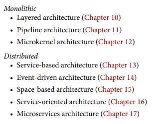

## Architecture Styles foundations

### Fecha: 23/08/2024

- **Notas:**
  - Los estilos arquitectonicos o patrones arquitectonicos describen una relación entre componentes y el cubirmiento de ciertas caracteristicas. Cada estilo captura un poder de detalle y entendimiento, desribiendo la topología y caracteristicas tanto buenas como malas. Un arquitecto debe estar familirizado con varios estilos.
  - Patrones fundamentales han sido nombrados en la historia del desarrollo de software, como el concepto de layer o capa.
  - La ausencia de cualquier estilo arquitectonico se conoce como Big Ball of Mud, un antipatrón. La falta de estructura hace que el cambio sea muy complicado.
  - La arquitectura unitaria fue cuando apareció el software, solo un computador y software corriendo en él. El desarrollo comercial se enfocaba a maquinas solitarias/single. Quedan pocas arquitecturas unitarias, seguramente en embedded systems.  
  - Luego aparece el concepto de client/server, particionado lo unitario. Un estilo fundamental de separar responsabilidades (como front/back) dió origen a las two-tier archs o client server archs, existen en muchos sabores distintos.
  - El desktop + database server construía interfaces de usuario como programas para distintos OS y comunicaba con standalone db servers en donde reside la parte logica de manera más robusta.
  - Luego pasamos al browser + web server tan común, pequeños clients como los browsers conectadas a un server en donde seguramente también tenemos patrón client/server separando el back de la db en otro servidor especializado pero esto se sigue considerando como un two tier (operation server - client browser).
  - Se popularizó luego la three tier en los 90's late, una base de datos en un servidor indistrial de bds, una aplicación en un server y un frontend generalmente en el navegador con el auge de JS. 
  - Las arquitetcuras se pueden clasificar en dos categorías grandes principales, monoliticas o distribuidas. Single deploy vs multiple deploy units, single quanta vs multiple quanta, comunicación interna vs remote access protocols.    
  
  - Pensamos que por el poder de la distribución en cuanto a escalabilidad, disponibilidad y performance son mejores, pero tiene también tarde/offs malos que analizar, además no deben construirse archs distribuidas sobre falacias. 
    - La red es fiable: No, las redes no son fiables y lo distribuido basa la comunicación en estas, por esto existen los timeouts o los circuit breakers, entre más nos fiemos de la red, pero arquitectura distribuida vamos a tener. 
    - Latencia es 0: No, un llamado local se mide en nano o micro segs, un llamado remoto se mide en mili segs. Siempre mayor el remoto, debemos preguntarnos cuál es el tiempo promedio de un round.trip de una petición REST o del protocolo que usemos. Es importante ese valor promedio de latencia para determianr factibilidad. También es el doble de importante conocer el 95th to 99th percentile, para también determinar si son tiempos factibles y que no muera la arquitectura. 
    - El ancho de banda es infinito: No, la comunicación entre servicios usa bastante ancho de banda haciendo que las redes se pongan lentas y por tanto generando más latencia. Es clave no hacer overfetch o stamp coupling en la comunicación que se realice entre componentes. Las soluciones son crear endpoints privados, usar selectores de campos como graphql, usar contratos value driven con contratos consumer driven (CDCs). Asegurar la minima cantidad de data posible.
    - La red es segura: No, el uso de VPNs VPCs firewalls es una ayuda para un red muy insegura, en la distribución cada componente debe ser seguro para comunicación y por tanto asergurar cada endpoint en los servicios es clave.
    - La topología nunca cambia: No, la topología de red como routers, switches y más cambia, además que son de proveedores distintos. La comunicación del arquitecto con administradores de red y proveedores es clave. 
    - Solo hay un admin de red: No, hay muchas personas involucradas administrando la red. 
    - El costo de transporte es 0: No, cada llamado simple REST por ejemplo tiene un costo, las distribuidas cuestan mucho más que las monoliticas. 
    - La red es homogenea: No, como mencionamos hay varios proveedores en la red.
  - Otras cosas a tener en cuenta son el loging, no es lo mismo determianr el orden en un monolito que en una distribuida, busque herramientas para esto. Las transacciones distribuidas son otro tema, en un monolito podemos tener ACID, las arquitecturas distribuidas tienen consistencia eventual para sync en los distintos quantas un estado. Transaction sagas o BASE trx son métodos/técnicas para esto (Basic avaliability, Soft state, Eventual consistency).
  - Mantenimiento y versionamiento de contratos, particularmente dificil el versionamiento en cada quanta y la sync entre los mismos.  
- **Preguntas:**
  - **1. List the eight fallacies of distributed computing.**  
  

    
Ver respuesta

    Ver arriba el detalle de las 8 falacias. 
  

  - **2. Name three challenges that distributed architectures have that monolithic architectures don’t.**  
  

    
Ver respuesta

    Logging, distributed trx, mantenimiento de contratos de respuesta. 
  

  - **3. What is stamp coupling?**  
  

    
Ver respuesta

    Ese tipo de acoplado es cuando se pasa más información de la necesaria en la comunicación y por tanto usamos más ancho de banda generando más latencia.
  

  - **4. What are some ways of addressing stamp coupling?**  
  

    
Ver respuesta

    Las soluciones son crear endpoints privados, usar selectores de campos como graphql, usar contratos value driven con contratos consumer driven (CDCs). Asegurar la minima cantidad de data posible.
  

## Recursos Adicionales
- [Course](https://fundamentalsofsoftwarearchitecture.com/)