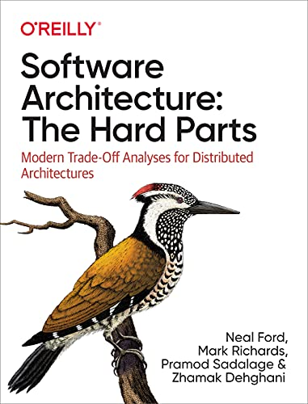

## Introducción

### Fecha: 20/10/2024

- **Notas:**
  - Existen muchos problemas en el mundo del software que no tienen buenas soluciones, sino menos peores y un conjunto de trade/offs. 
  - Para la arquitetura no sirve Googlear, todo problema es muy único pues el contexto es muy relevante.
  - El trabajo real de un arquiecto es la habilidad para objetivamente determinar el conjunto de trade/offs para tomar una decisión de la mejor manera que sea posible. 
  - Hard de dificil y de solido, problemas complejas y también de establecer las bases, el hardware del software es una analogía. 
  - Cuando revisamos un estilo X de arquitectura debemos entender su conexto histórico, sus limitaciones del momento. Cómo escribimos algo que no envejezca al momento? No debemos enfocarnos en tech ni implementaciones, no nos enfocamos en diseño detallado sino en arquitetura y los escenarios contemporaneos para tomar decisiones. 
  - La data lo es todo, arquitectos deben trabajar de la mano con DBAs, la data es el activo más importante de una companía, con la distribución se volvió más complicado manejar la data y la toma de decisiones. Mucho de la dificultad surge de esto, data y arch. La data es operacional o analitica.  
  - Usar ADR's para documentar las decisiones tomadas, pequeño archivo de texto con decisión contexto, por qué y consecuencias como min. 
  - Usar funciones fitness para asegurarse que se cumplan los principios de diseño y se implementen como debe ser. Hacen parte de la governanza de la arquitectura, supervisión organizada de uno o más aspectos del desarrollo de software.  
  - La automatización y el feed se conviertieron en principios del desarrollo, lo automatico continuo es a lo que debe apuntarse pues la manualidad cae en errores y olvidos fácilmente. La FF es cualquier mecanismo (muchas herramientas existen) que haga una evaluación objetiva de una o unas ilities de la arch. La objetividad de muy importante, algo medible y determinar si es atomica (una sola ilitie) o holistica (varias) es importante para determinar la medición (Agilidad = deploy + test). 
  - Implementar FFs para proteger el cambio constante sobre la arquitectura, una FF para arch un test para código (se relaciona con algo del dominio). No debemos irnos al extremo de hacer un ambiente hostil lleno de FFs que frusten y retrasen todo, haga de las FFs una checklist de principios importantes. 
  - Definiciones 
    - Servicio: Colección cohesiva de funcionalidades desplegadas como un ejecutable independiente. 
    - Coupling: Dos servicios o compos son acoplados si cambio en uno requiere cambio en otro. 
    - Componente: Bloque de cosntrucción de arch, ejecuta cierta lógica de negocio o de infra, se manifiesta como un grupo físico de archivos dentro de una estructura de dirs. 
    - Sync/Async: Esperar o no por respuesta. 
    - Orch/Choreo: Incluir o no un servicio que se encargue de coordinar el flujo de llamados. 
    - Atomicidad/Consistencia eventual: Todas las partes de un flujo mantienen un estado consitente en la data. 
    - Contrato: Interfaz que define la comunicación. 
  - Problema del libro: Sysops squad saga. 
    - Tienda de electronicos en un país que cuenta con un grupo de soporte en donde están estos actores, admin, customers, expert y manager. Hay workflow que tienen que ver con el ticket (lo que pone un customer cuando tiene un problema) y otros que no como el manejo de customer data, manejo de experts, bills mensuales, reports. Actualmente hay problemas de disponinilidad, un monolito cona db y un schema, el cambio es riesgoso y dificil, lost tickets, sistema con falta de fiabilidad y mucho bug. 

## Recursos Adicionales
- [Course](https://fundamentalsofsoftwarearchitecture.com/)